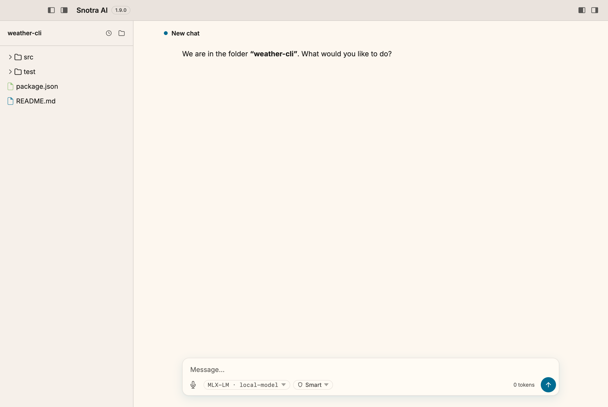

# Snotra AI

**Ein quelloffener Desktop-Agent, der um deinen Ordner gebaut ist: immer im
Blick, und nichts passiert darin, ohne dass er fragt. Cloud- oder lokale
Modelle, kein Konto, keine Telemetrie.**

[**Download**](https://github.com/kkrafft1999/snotra/releases/latest) ·
[Website](https://snotra-ai.de) ·
[Warum Snotra?](#warum-snotra) ·
[Aus dem Quellcode bauen](#aus-dem-quellcode-bauen) ·
[English](./README.md)

<picture>
  <source media="(prefers-color-scheme: dark)" srcset="assets/readme/demo-dark.gif">
  
</picture>

**Funktioniert mit** OpenAI · Anthropic · Google Gemini · Ollama · jeder
OpenAI-kompatiblen API (LM Studio, MLX-LM, llama.cpp, vLLM, OpenRouter …)

**Erweiterbar mit** Agent Skills (`SKILL.md`) · MCP-Servern (stdio) ·
eingebauten Workspace-Werkzeugen · jedem CLI auf deinem Rechner

**Läuft auf** macOS (Apple Silicon) · Windows (x64) · Linux (x64)

> Status: ein privates Open-Source-Projekt — keine Firma dahinter, kein
> Bezahlmodell. Schnittstellen und Konfiguration können sich noch ändern.

## Wie Snotra arbeitet

- **Der Ordner ist der Arbeitsplatz.** Du öffnest einen Ordner; der Dateibaum
  bleibt im Blick, und der Chat arbeitet darin. Dateien, die der Agent
  schreibt, erscheinen, während er sie schreibt.
- **Er fragt, bevor er handelt.** Im Standardmodus *Intelligent* liest er, ohne zu
  fragen; eine Datei ändern oder eine sensible anfassen fragt vorher. Befehle
  ausführen ist aus, bis du es einschaltest, und dann bekommt jeder Befehl
  seine eigene Freigabe-Karte.
- **Auto ist deine Entscheidung, nicht der Standard.** Der Modus *Auto* lässt
  die Rückfragen weg — Workspace-Grenzen, Sperren und der Schutz der
  Snotra-Schlüssel bleiben. Du schaltest ihn bewusst ein.
- **Deine Modelle, deine Schlüssel.** Cloud- und lokale Modelle stehen in einer
  Liste nebeneinander; du wechselst je Unterhaltung. Schlüssel liegen in der
  Verschlüsselung des Betriebssystems.
- **Nichts meldet sich nach Hause.** Kein Konto, kein eigener Server, keine
  Telemetrie — auch nicht als Opt-in.

## Download

Die neueste Version liegt auf der
[Release-Seite](https://github.com/kkrafft1999/snotra/releases/latest):

| System | Datei |
| --- | --- |
| macOS (Apple Silicon) | `Snotra-AI-<version>-mac-arm64.dmg` |
| Windows (x64) | `Snotra-AI-<version>-win-x64.zip` |
| Linux (x64) | `.deb` (empfohlen), `.AppImage` oder `.tar.gz` — siehe [Linux installieren](#linux-installieren) |

**Die Builds sind noch nicht signiert**
([#19](https://github.com/kkrafft1999/snotra/issues/19)), deshalb warnen macOS
und Windows beim ersten Start:

- **macOS:** DMG öffnen, App nach Programme ziehen. Starten, Meldung
  wegklicken, dann *Systemeinstellungen › Datenschutz & Sicherheit › Trotzdem
  öffnen*. Fehlt die Option oder hilft sie nicht, nimmt dieser Befehl die
  Quarantäne-Markierung von Hand weg:

  ```bash
  xattr -dr com.apple.quarantine "/Applications/Snotra AI.app"
  ```

- **Windows:** ZIP entpacken, `Snotra AI.exe` starten, dann *SmartScreen ›
  Weitere Informationen › Trotzdem ausführen*.

## Warum Snotra?

Open Source, beliebige Modelle, MCP und Skills bietet inzwischen jeder
Agent-Desktop. Snotra unterscheidet sich darin, wie es in deinem Ordner
arbeitet und wie vorsichtig es dort handelt. Verglichen im September 2026 —
das Feld bewegt sich schnell, Korrekturen willkommen.

- **Goose** — der nächste Open-Source-Verwandte, und ein gutes Werkzeug. Goose
  arbeitet per Default autonom; Snotra startet mit ausgeschalteter
  Befehlsausführung und fragt vor jedem Befehl. Ein „erlauben“ für die ganze
  Sitzung gibt es für Befehle nicht, außer du schaltest die ganze App auf
  *Auto*. Goose' Nutzungsdaten sind Opt-in; bei Snotra gibt es keine.
- **Claude Desktop / ChatGPT Desktop** — ausgereift, und sie isolieren gut.
  Aber sie brauchen ein Konto und ein Abo, sie hängen an einem Anbieter, und
  lokale Modelle sind Nebensache.
- **LM Studio (Bionic)** — hervorragend, um lokale Modelle zu betreiben, mit
  nativem MLX. Aber der Agent ist nicht quelloffen, und seine Cloud ist die
  von LM Studio, also ohne Modelle von OpenAI, Anthropic oder Google. Snotra
  nutzt LM Studio als einen Provider unter mehreren und behandelt Cloud- und
  lokale Modelle gleich.
- **Jan** — quelloffen und local-first. Sein Ordner-Agent und seine Sandbox
  stecken in Nightly- und Preview-Builds; die stabile App ist ein Chat-Client
  mit MCP.
- **Cherry Studio** — sehr umfangreich und im Umfang nah dran. Analytics sind
  per Default an, und eine Sandbox für Agent-Befehle ist nicht dokumentiert.
- **AnythingLLM** — gebaut, um mit den eigenen Dokumenten zu chatten (RAG).
  Seine Skills sind NodeJS-Code, keine Textdateien, und es hat kein
  Shell-Werkzeug.
- **Open WebUI / LibreChat** — selbst gehostete Web-Apps mit Login und Docker:
  ein Server fürs Team, kein Desktop-Agent in deinem Ordner.
- **Msty** — nicht quelloffen. Sein Agent-Modus verpackt Cloud-Coding-CLIs,
  statt einen eigenen Agenten auf deinen Modellen laufen zu lassen.
- **VS Code + Copilot/Cline, Cursor** — sie haben den Dateibaum, weil sie
  Code-Editoren sind. Snotra hält den Ordner im Blick, ohne eine IDE zu sein,
  für Arbeit, die kein Code ist.

Was Snotra noch fehlt: signierte Builds
([#19](https://github.com/kkrafft1999/snotra/issues/19)), eine Sandbox für
Befehle ([#329](https://github.com/kkrafft1999/snotra/issues/329)), MCP über
HTTP.

## Motivation

*Ein Wort des Autors.*

Angefangen hat es mit dem Wunsch, **agentisches Arbeiten zu verstehen** — Agentic
Coding und KI-Agenten allgemein. Deshalb stand am Anfang ein einfaches
Experiment: Chats führen, um den Informationsaustausch zwischen einem
Sprachmodell und einem lokalen Client nachzubauen, so wie ChatGPT oder Claude
Code das tun — schlicht, um selbst zu sehen, was zwischen LLM und Agent Harness
tatsächlich hin- und hergeht.

Irgendwann wurde aus dem Experiment der eigentliche Spaß. Mit den Varianten
herumzuspielen und Snotra eine weitere Fähigkeit mitzugeben, macht mir Freude —
und genau daran ist das Projekt gewachsen.

Die Vorbilder liegen auf der Hand: **Cursor, Claude Code, ChatGPT** fahren
denselben Ansatz. Gemeinsam ist ihnen, dass sie sich auf ihre eigenen Modelle
konzentrieren — mit Cursor als Ausnahme, und selbst Cursor dürfte künftig
stärker in der Hand von xAI liegen, sodass auch dort die Modelle von dieser Seite
bevorzugt werden. Ein Agent Harness, ein Agent Desktop, an den sich **beliebige
Modelle** anbinden lassen — und vor allem lokale Modelle zum Ausprobieren —, ist
der Grund, warum ich drangeblieben bin.

Und nicht zuletzt: Snotra soll ein Werkzeug sein, mit dem Entwickler agentisches
Arbeiten selbst ausprobieren können — und mit dem sich auf dieser
Open-Source-Grundlage Agenten für **konkrete Use Cases** bauen lassen: für
Fachabteilungen im Unternehmenskontext genauso wie für private Zwecke im
Consumer-Bereich, aufgesetzt auf dem Agent Harness von Snotra. Die Architektur
ist so geschnitten, dass sich das Backend vom Frontend trennen lässt. Was sich
daraus sonst noch machen lässt, überlasse ich gern der Entwickler-Community und
ihrer Fantasie.

Der Name stammt aus der nordischen Mythologie: Snotra ist die Göttin der
Klugheit und Besonnenheit. Er steht für einen Assistenten, der den Kontext
seines Workspace kennt und überlegt handelt.

## Aktueller Stand & Planung

Alles, was ansteht — Bugs, einzelne Features und größere Themen —, läuft über [GitHub Issues](https://github.com/kkrafft1999/snotra/issues). Den Fortschritt zeigt das zugehörige [GitHub Project](https://github.com/kkrafft1999/snotra/projects) (Kanban-Board: *Backlog* → *Ready* → *In progress* → *In review* → *Done*).

Du willst mitmachen? Siehe [`CONTRIBUTING.md`](./CONTRIBUTING.md) (Englisch).

## Tech-Stack

- [Electron](https://www.electronjs.org/) (Main + Renderer + Preload)
- [Electron Forge](https://www.electronforge.io/) für Packaging & Maker (DMG / ZIP / DEB / AppImage)
- Vanilla JS im Renderer + [`marked`](https://github.com/markedjs/marked) und [`DOMPurify`](https://github.com/cure53/DOMPurify) für Markdown
- [`@fontsource/inter`](https://fontsource.org/fonts/inter) als Schriftart

## Voraussetzungen

- **Node.js** ≥ 24 (Active LTS, siehe `.nvmrc`; mit nvm: `nvm use`)
- **npm** (kommt mit Node)
- macOS, Windows oder Linux
- Optional: API-Key für OpenAI / Anthropic / Google, ein lokales [Ollama](https://ollama.com/) oder irgendein anderer Server mit OpenAI-kompatibler Schnittstelle (LM Studio, llama.cpp, vLLM, OpenRouter, ein Firmen-Gateway — siehe [Anbieter](#anbieter))

## Aus dem Quellcode bauen

```bash
# Repository klonen
git clone git@github.com:<dein-user>/snotra.git
cd snotra

# Abhängigkeiten installieren
npm install

# App im Entwicklungsmodus starten
npm start
```

Beim ersten Start kannst du in den Einstellungen einen Provider wählen und deinen API-Key eintragen. Der Key wird verschlüsselt im Benutzerprofil deines Betriebssystems abgelegt – er landet **nicht** im Projektordner und nicht im Repository.

## App bauen / paketieren

```bash
# macOS (Apple Silicon) – DMG + ZIP
npm run make

# Linux (x64) – DEB + AppImage; braucht dpkg, fakeroot und mksquashfs
npm run make:linux

# Nur paketieren ohne Installer
npm run package         # macOS arm64
npm run package:win     # Windows x64
npm run package:linux   # Linux x64
```

Die fertigen Artefakte landen im Ordner `out/` (per `.gitignore` ausgeschlossen).

### Linux installieren

Die [Releases](https://github.com/kkrafft1999/snotra/releases) enthalten für
Linux drei Dateien:

```bash
# Empfohlen (Debian, Ubuntu, Mint, Pop!_OS …): legt Menüeintrag und Icon an
sudo apt install ./Snotra-AI-<version>-linux-x64.deb

# Distributionsunabhängig: eine Datei, kein root nötig
chmod +x Snotra-AI-<version>-linux-x64.AppImage
./Snotra-AI-<version>-linux-x64.AppImage

# Fallback, wenn beides nicht passt
tar -xzf Snotra-AI-<version>-linux-x64.tar.gz
cd snotra-ai-<version>-linux-x64
./"Snotra AI"
```

Das `.deb` ist der empfohlene Weg: Es ist die einzige Variante, in der die
Chromium-Sandbox fertig eingerichtet ist (Setuid-Bit auf `chrome-sandbox`), und
es trägt die App ins Anwendungsmenü ein. Das **AppImage** braucht dafür weder
Installation noch root-Rechte — nach dem Download einmal ausführbar machen, das
Ausführungsrecht überlebt den Umweg über den Browser nicht.

**AppImage und Tarball** verlassen sich stattdessen auf unprivilegierte
User-Namespaces. Auf Distributionen, die diese einschränken — u. a. Ubuntu ab
24.04 —, kann der Start fehlschlagen. Beim **Tarball** meldet sich das als
*„The SUID sandbox helper binary was found, but is not configured correctly"*;
dort hilft es, im entpackten Ordner einmal nachzuziehen:

```bash
cd snotra-ai-<version>-linux-x64
sudo chown root:root chrome-sandbox && sudo chmod 4755 chrome-sandbox
```

Beim **AppImage** führt dieser Weg nicht zum Ziel: Das Image wird
schreibgeschützt und `nosuid` eingehängt, ein Setuid-Bit hätte darin keine
Wirkung. Dort ist das `.deb` die Lösung.

Das `.deb` bringt außerdem `bubblewrap`, `socat` und `ripgrep` mit, die die
Sandbox für Shell-Befehle und Python braucht (siehe [Die Sandbox je
Betriebssystem](#die-sandbox-je-betriebssystem)). Beim AppImage und beim
Tarball installierst du sie selbst: `sudo apt install bubblewrap socat ripgrep`.

## Aktualisierung

Snotra AI sucht beim Start still nach einer neueren Version und meldet sich nur,
wenn es eine gibt; *Hilfe › Nach Updates suchen…* — oder *Nach Updates suchen*
neben der Versionsnummer unten in den Einstellungen — fragt jederzeit von Hand
nach. Ab dann führt ein Dialog durch den ganzen Weg — **jeder Schritt einzeln
bestätigt, jeder bis zuletzt abbrechbar**:

1. **Gefunden.** Version, Größe des Pakets und „Was sich geändert hat".
   „Herunterladen" lädt, „Diese Version überspringen" bietet genau diese
   Version nie wieder an, „Später erinnern" fragt beim nächsten Start erneut.
2. **Wird geladen.** Fortschritt in Prozent und Megabyte. „Abbrechen" bricht
   den Download wirklich ab und räumt die halbe Datei weg.
3. **Bereit.** Erst jetzt wird gefragt, ob installiert werden soll. Beim
   Installieren beendet sich die App, wird ersetzt und startet neu — ungesendete
   Eingaben gehen dabei verloren. „Abbrechen" verwirft die geladene Datei.
4. **Wird installiert.** Der einzige Schritt ohne Rückweg; das steht auch so im
   Dialog.

Geladen wird ausschließlich das Release-Asset, das GitHub selbst für die
laufende Installation ausweist — die Adresse kommt nie aus dem Fenster. Vor dem
Austausch prüft die App unter macOS zusätzlich die Bundle-Kennung und die
Versionsnummer im geladenen Paket. Schlägt irgendetwas fehl, bleibt die laufende
Version unangetastet und der Dialog nennt den Grund.

**Wann die App sich nicht selbst aktualisiert.** Dann erklärt der Dialog, warum,
und verweist auf die Release-Seite:

| Fall | Grund |
| --- | --- |
| Als `.deb` nach `/opt` installiert | Der Austausch bräuchte Administratorrechte. |
| Kein Schreibrecht am Installationsort | z. B. `C:\Program Files` oder ein Mehrbenutzer-Mac. |
| Entwicklungs-Build (`npm start`) | Da gibt es nichts zu ersetzen. |
| Kein passendes Paket im Release | Lieber nichts anbieten als das Falsche einspielen. |

Selbst aktualisieren können sich das macOS-App-Bundle, das Windows-Verzeichnis,
ein laufendes AppImage und ein entpacktes Linux-Verzeichnis.

Weil die Artefakte **unsigniert** sind, kommt bewusst kein `electron-updater`
bzw. Squirrel zum Einsatz — beide setzen eine Code-Signatur voraus.


## Dateibaum

- **Projektordner öffnen:** über den Knopf in der Seitenleiste oder die Liste der zuletzt genutzten Ordner. Alles Weitere bezieht sich immer auf diesen einen Ordner.
- **Vier Spalten, vier Schalter:** Das Fenster besteht aus Seitenleiste, Anzeige, Chat und Verlauf, und jede Spalte hat ihren eigenen Schalter in der Titelzeile — links die beiden des Arbeitsbereichs, rechts spiegelverkehrt die beiden der Chat-Seite, jeweils in der Reihenfolge ihrer Spalten. Alle vier tragen dasselbe Bild: ein Fenster mit einer schmalen und einer breiten Fläche, gefüllt ist die, die der Knopf schaltet. Jeder Zustand bleibt bis zum nächsten Start erhalten.
- **Seitenleiste wegschalten:** Der erste Knopf blendet die Seitenleiste samt Trenner aus, der Arbeitsbereich rückt nach. Dasselbe per Tastatur mit `Cmd/Strg+B` oder über *Ansicht › Seitenleiste ein-/ausblenden* (alle Kürzel unter [Tastenkürzel](#tastenkürzel)).
- **Mittlere Anzeige ein- und ausblenden:** Der zweite Knopf schaltet die mittlere Spalte — die, in der die Dateivorschau und der Startschirm stehen. Solange du nichts eingestellt hast, entscheidet der Ordner: Mit geöffnetem Ordner bleibt die Spalte **zu**, der Chat bekommt die Breite. Ist kein Ordner offen, steht dort der Startschirm, und zwar genau so breit, wie er ihn braucht — der Rest des Fensters gehört dem Chat. Klickst du eine Datei im Baum an, kommt die Spalte von selbst zurück, sonst ginge der Klick ins Leere. Schaltest du sie über den Knopf ein oder aus, gilt deine Entscheidung ab dann auch beim Start.
- **Chat wegschalten:** Der vorletzte Knopf nimmt die Chat-Spalte weg; übrig bleibt rechts der Verlauf, falls er offen ist. Klickst du dort einen Chat an, kommt die Spalte von selbst zurück — spiegelbildlich zum Klick auf eine Datei im Baum. Die **Einstellungen** erreichst du unabhängig davon über die Menüleiste bzw. `Cmd/Strg+,` — auf dem Mac unter *Snotra AI › Einstellungen…*, unter Windows und Linux unter *Ansicht › Einstellungen…*.
- **Chat-Verlauf einblenden:** Der letzte Knopf stellt den Verlauf als Spalte neben den Chat. Ein Klick auf eine Zeile lädt diese Konversation samt ihrem Modell und ihrem Freigabemodus, das Papierkorb-Symbol entfernt sie. Der Knopf für einen **neuen Chat** steht in der Kopfzeile dieser Spalte — so wie „Ordner öffnen“ in der Kopfzeile des Baums. Wird das Fenster zu schmal für alle Spalten, weicht der Verlauf von selbst und kommt im breiteren Fenster zurück.
- **So, wie du die App verlassen hast:** Beim Start holt Snotra die zuletzt geführte Konversation des Ordners zurück und du landest direkt im Gespräch. Der Startschirm („Womit fangen wir an?“) gehört zum kalten Start: Er steht in der mittleren Spalte und erscheint, wenn kein Ordner offen ist und es nichts fortzusetzen gibt — beim allerersten Start also von selbst. Auch das Fenster kommt zurück, wie du es zuletzt eingestellt hast: Größe, Position und ob es maximiert oder im Vollbild lief. Beim allerersten Start geht es mit 1536 × 960 Punkten auf, auf kleineren Bildschirmen so groß, wie die Arbeitsfläche hergibt. Hast du den Zweitbildschirm abgezogen, auf dem es zuletzt stand, kommt es in derselben Größe zentriert auf dem Hauptbildschirm zurück statt im Nichts.
- **Verschieben:** Eine Datei oder einen Ordner im Baum auf eine Ordnerzeile ziehen verschiebt den Eintrag dorthin; auf der freien Fläche unter dem Baum landet er im Projektordner. Gibt es den Namen schon, wird `name (2).ext` daraus.
- **Im Chat referenzieren:** Eine Datei oder einen Ordner in die Chat-Eingabe ziehen fügt dort `@<pfad relativ zur Projektwurzel>` ein; derselbe Weg ohne Ziehen ist der `@`-Knopf rechts in der Zeile (Hover oder Tabulator). Details unter [Chat](#chat).
- **Kontextmenü:** Rechtsklick (oder ⌘-/Strg-Klick, siehe [Tastenkürzel](#tastenkürzel)) auf eine Zeile öffnet „Öffnen“, „Im Finder anzeigen“ (unter Windows „Im Explorer anzeigen“, unter Linux „Im Dateimanager anzeigen“), „Informationen“ und „Löschen…“. Gelöscht wird in den Papierkorb, nach Rückfrage.
- **Informationen:** Der Eintrag „Informationen“ zeigt zu einer Datei Name, vollständigen Pfad, Typ, Größe (lesbar und auf das Byte genau), Änderungs- und Erstellungsdatum sowie das Programm, mit dem „Öffnen“ sie starten würde. Bei einem Ordner steht statt der Größe die Anzahl seiner direkten Einträge — rekursiv gezählt wird bewusst nicht, das kann bei `node_modules` beliebig lange dauern. Der Knopf **„Pfad kopieren“** legt den vollen Pfad in die Zwischenablage. Werte, die das Betriebssystem nicht hergibt — unter Linux oft das Erstellungsdatum —, stehen als „unbekannt“ da.
- **Von außen übernehmen:** Dateien und Ordner aus Finder oder Explorer lassen sich direkt in den Baum ziehen — auf eine Ordnerzeile oder auf die freie Fläche für den Projektordner. Sie werden **kopiert**, das Original bleibt liegen; Mehrfachauswahl geht, Namenskollisionen enden wie oben als `name (2).ext`.

  Weil damit zum ersten Mal etwas von außerhalb des Projektordners hereinkommt, fragt Snotra vorher nach: bei Ordnern immer, bei Dateien ab 20 Stück oder 10 MB — mit Anzahl, Größe und Zielordner im Klartext, „Abbrechen“ vorbelegt. Nicht übernommen werden Dateien, die nach Zugangsdaten aussehen (`.env`, `*.pem`, `id_*`, alles unter `.ssh/` …): Was das Modell später lesen könnte, soll nicht beiläufig per Drop hereinrutschen — der Weg über den Dateimanager bleibt offen. Verknüpfungen (Symlinks) werden übersprungen, und ein Drop wird ganz abgelehnt statt halb kopiert, wenn er über 2000 Einträge oder 200 MB liegt.

## Chat

- **Senden:** `Enter` schickt die Nachricht ab, `Shift+Enter` fügt einen Zeilenumbruch ein. Während das Modell antwortet, wird der Senden-Button zum Abbrechen-Button. Die übrigen Kürzel stehen gesammelt unter [Tastenkürzel](#tastenkürzel).
- **Dateien per `@` referenzieren:** Tippst du `@` in die Eingabe, öffnet sich über dem Textfeld eine Liste der Dateien und Ordner des geöffneten Projektordners. Weiteres Tippen filtert – auch unscharf, `@rlse` findet z. B. `docs/release.md` –, `↑`/`↓` wählt, `Enter` oder `Tab` übernimmt, `Esc` schließt. Eingefügt wird der Pfad relativ zur Projektwurzel (`@docs/release.md`); bei Ordnern bleibt die Liste offen (`@src/`), so dass du direkt in den Ordner weitertippen kannst. Die Liste blendet aus, was auch das Tool `find_files` überspringt: versteckte Einträge, `.git` und Muster aus der `.gitignore` des Projektroots. Ohne geöffneten Ordner bleibt `@` normaler Text.
- **Dateien aus dem Baum übernehmen (Maus):** Was du im Dateibaum schon vor Augen hast, musst du nicht abtippen. Zieh die Datei oder den Ordner aus dem Baum in die Chat-Eingabe — eingefügt wird an der Cursorposition der Pfad **relativ zur Projektwurzel** (`@docs/release.md`, Ordner mit `/` am Ende), nicht der absolute Pfad. Ohne Ziehen geht es über den `@`-Knopf, der rechts in der Zeile erscheint, sobald du mit der Maus über die Zeile fährst oder den Knopf per Tabulator ansteuerst. Der einfache Klick auf eine Zeile bleibt, was er war: auswählen und Vorschau zeigen; das Verschieben im Baum per Drag & Drop ebenfalls.
- **Screenshots einfügen:** Ein Bild in der Zwischenablage (macOS `Cmd+Ctrl+Shift+4`, Windows Snipping Tool) landet mit `Cmd/Ctrl+V` als Anhang über der Eingabezeile — mit Vorschau, Dateigröße und einem Knopf zum Entfernen. Der getippte Text bleibt dabei unberührt; ein Screenshot ohne Begleitfrage lässt sich ebenfalls abschicken. Erlaubt sind PNG, JPEG, GIF und WebP, bis zu 4 Bilder je Nachricht und 5 MB pro Bild; größere Bilder werden vor dem Senden auf 1568 px längste Kante verkleinert. Weil ein Screenshot oft mehr zeigt, als man bewusst teilen will, siehst du vor dem Senden immer die Vorschau — bei einem Cloud-Anbieter verlässt das Bild deinen Rechner. Bilder weiterreichen kann **OpenAI** und, wenn du den Schalter „Bild-Anhänge erlauben“ setzt, der Anbieter **OpenAI-kompatibel**: Ist ein anderer Anbieter aktiv, wird das Einfügen mit einem Hinweis in der Statuszeile abgelehnt, statt still zu verschwinden — und hängst du ein Bild an und wechselst danach auf ein Modell ohne Bild-Unterstützung, sagt Snotra das beim Senden, bevor die Anfrage rausgeht. Angehängte Bilder gehören zum gespeicherten Verlauf: Sie liegen als Dateien unter `chat-attachments/<Chat-ID>/` im `userData`-Ordner — unverschlüsselt, wie die Screenshots auf deiner Platte auch —, während die Verlaufsdatei nur den Dateinamen trägt und schlank bleibt. Beim Öffnen einer älteren Konversation sind die Bilder wieder da; ein Klick auf das Vorschaubild zeigt es groß. Löschst du einen Chat, verschwinden seine Bilder mit; dasselbe gilt, wenn er aus dem Verlauf herausfällt. Ist eine Datei von Hand entfernt worden, steht an ihrer Stelle ein Hinweis statt eines kaputten Bildes.
- **Bilder aus dem Arbeitsordner in der Antwort:** Schreibt das Modell ein Bild in den Projektordner — ein gerechnetes Diagramm, einen Plot — und bettet es danach in seine Antwort ein (``), zeigt Snotra es im Chat an, auf Chat-Breite verkleinert und mit erhaltenem Seitenverhältnis. Es gilt der **gerade geöffnete** Ordner: relative und absolute Pfade werden gegen ihn aufgelöst, alles außerhalb wird nicht geladen — auch keine Verknüpfung, die aus dem Ordner herauszeigt, und keine Adresse aus dem Netz. Angezeigt werden PNG, JPEG, GIF und WebP bis 10 MB, erkannt am Dateiinhalt statt an der Endung; SVG bleibt vorerst außen vor. Geht es nicht, steht dort kein kaputtes Bild, sondern ein Platzhalter mit dem Grund („Bild nicht gefunden“, „Außerhalb des Arbeitsordners“, „Bild zu groß zum Anzeigen“) und dem Alt-Text des Modells. Während die Antwort noch läuft, steht ein ruhiger Platzhalter — das Bild erscheint, wenn die Nachricht fertig ist, statt bei jedem Textstück neu zu laden. Öffnest du eine ältere Konversation in einem anderen Ordner, siehst du Platzhalter statt fremder Bilder; auf den früheren Ordner greift Snotra nie zu.
- **Was das Modell davon sieht:** nur die Referenz im Text. Der System-Prompt erklärt die `@pfad`-Konvention; die Datei liest das Modell bei Bedarf selbst über die Lese-Tools, Inhalte werden nicht automatisch eingebettet (Token-Ziel).

- **Python ausführen (standardmäßig aus):** Nach dem Einschalten unter Einstellungen › Tools › „Python ausführen“ bekommt das Modell das Tool `run_python`: es schreibt ein Python-3-Programm, Snotra führt es im geöffneten Projektordner aus und gibt Ausgabe, Fehlerausgabe und Exit-Code zurück. Damit werden Auswertungen gerechnet statt geschätzt — Summen über eine CSV, Umrechnungen, Datenumformung, Regex an echten Beispielen prüfen. Jeder Aufruf ist ein frisches Skript, es gibt keinen Zustand zwischen Aufrufen und kein `pip install`; welche Pakete verfügbar sind, bestimmst du über einen eigenen Interpreter-Pfad (z. B. ein venv). Gesucht wird der Interpreter in **deinem** PATH — Snotra liest ihn beim Start einmal aus deinem Shell-Profil, damit auch eine aus dem Finder gestartete App den Homebrew-, pyenv- oder asdf-Python findet statt des System-Python; Unterprozesse im Skript (`subprocess`) sehen denselben PATH. Welcher Interpreter gefunden wurde, steht unter Einstellungen › Tools.

  **Das ist die riskanteste Einstellung der App — wie riskant, hängt von deinem System ab.** Unter **macOS und Linux** läuft der Code in einer Sandbox: Er darf nur im Projektordner und in einem temporären Ordner schreiben, kann keine Schlüssel, Cloud-Zugangsdaten oder Browserdaten lesen und erreicht das Netzwerk nur für die Domains, die er angibt und die die Freigabekarte auflistet. Deine übrigen Dateien kann er weiterhin *lesen*. Unter **Windows** gibt es noch keine Sandbox: Der Code läuft mit deinen Rechten und kann überall lesen und schreiben, ins Netz gehen und Programme starten. So oder so steht die Freigabe vorn: Snotra zeigt dir vor jedem einzelnen Lauf den vollständigen Quelltext, und eine Pille auf der Karte sagt, ob der Lauf isoliert ist — „Nicht isoliert“ in Rot. Ein „Für diese Sitzung erlauben“ gibt es für Ausführung bewusst nicht. Läuft ein Skript zu lange, wird es nach dem Zeitlimit (Standard 10 s) beendet; „Stop“ im Chat beendet es ebenfalls.

- **Shell-Befehle ausführen (standardmäßig aus):** Nach dem Einschalten unter Einstellungen › Tools › „Shell-Befehle ausführen“ bekommt das Modell das Tool `shell_execute`: es führt einen Befehl in der Shell deines Betriebssystems aus — macOS und Linux in deiner Login-Shell (zsh, bash, …), Windows in PowerShell bzw. `cmd.exe` — und liefert Ausgabe, Fehlerausgabe und Exit-Code zurück. Damit wird nutzbar, was ohnehin auf deinem Rechner liegt: `git status`, `npm run build`, `docker ps`, ein installiertes CLI-Werkzeug, das ein Skill beschreibt. Weil POSIX-Shells als **Login-Shell** starten und Snotra deinen PATH beim Start einmal aus dem Profil liest — interaktiv, also einschließlich `.zshrc` —, ist dein gewohnter PATH da (Homebrew, nvm, pyenv), auch wenn du die App aus dem Finder gestartet hast. Ausgeführt werden Befehle trotzdem nicht interaktiv, damit kein Prompt-Vorlauf in der Ausgabe landet. Arbeitsverzeichnis ist der Projektordner oder ein Unterordner davon; ein Befehl pro Aufruf, kein Zustand zwischen zwei Aufrufen (ein `cd` wirkt nur innerhalb desselben Befehls). Nicht interaktiv: es gibt kein Terminal, eine wartende Eingabeaufforderung läuft ins Zeitlimit (Standard 30 s, höchstens 300 s). Welche Shell benutzt wurde, steht im Ergebnis und auf der Freigabekarte.

  **Das ist die weitreichendste Einstellung der App.** Unter **macOS und Linux** läuft jeder Befehl in einer Sandbox: Er schreibt nur im Projektordner und in einem temporären Ordner (Caches wie die von pip und npm landen ebenfalls dort), kann keine Schlüssel, Cloud-Zugangsdaten oder Browserdaten lesen und erreicht das Netzwerk nur für die Domains auf der Freigabekarte — `pip install` und `npm install` bekommen ihre Registry automatisch, alles andere muss das Modell benennen. Unter **Windows** gibt es noch keine Sandbox: Ein Befehl kann alles, was du selbst im Terminal kannst — überall lesen und schreiben, ins Netz gehen, Programme installieren. Snotra zeigt dir vor jedem einzelnen Lauf den vollständigen Befehl, die Shell, das Arbeitsverzeichnis und ob der Lauf isoliert ist, und ein „Für diese Sitzung erlauben“ gibt es für Ausführung bewusst nicht. Stattdessen kannst du dir eine **exakte, einfache Befehlszeile** für den geöffneten Ordner merken lassen — „Diesen Befehl immer erlauben“ auf der Karte, bestätigt im Systemdialog: `git status` läuft dann im Modus „Intelligent“ ohne Rückfrage, während `git status --short`, derselbe Befehl in einem anderen Ordner, mit anderen Netzwerk-Domains, mit Verkettung, Pipes, Umleitung, Variablen oder Anführungszeichen weiterhin jedes Mal fragt. Gesperrt sind rekursives Zwangslöschen (`rm -rf` und Entsprechungen), Datenträgeroperationen und das Umschreiben der Git-Historie — das ist eine zusätzliche Sicherung, **kein** vollständiger Schutz, denn ein Skript oder ein Interpreter dazwischen umgeht jede Musterliste. Im Modus „Auto“ läuft ein Befehl ohne Rückfrage — isoliert, wo die Sandbox greift. „Stop“ im Chat und das Zeitlimit beenden den ganzen Prozessbaum, nicht nur die Shell.

- **Websuche:** Mit einem hinterlegten Tavily-Schlüssel (Einstellungen › Tools › Websuche) bekommt das Modell das Tool `web_search` — es liefert Titel, URL und einen kurzen Auszug je Treffer, keine ganzen Seiten. Ohne Schlüssel wird das Tool gar nicht erst angeboten. Die Suchanfrage verlässt deinen Rechner, deshalb ist das Tool als **externer Dienst** eingestuft: im Modus „Intelligent“ fragt Snotra vor jeder Suche nach. Einen kostenlosen Schlüssel gibt es unter [app.tavily.com](https://app.tavily.com); er wird wie die Modell-Schlüssel verschlüsselt abgelegt. Einen geöffneten Projektordner braucht die Suche nicht — anders als die Datei-Tools steht sie auch im leeren Chat zur Verfügung.
- **Seiten lesen:** Was `web_search` an Adressen findet, liest das Tool `fetch_url` am Stück: es ruft genau eine http(s)-Adresse ab und liefert den lesbaren Text der Seite statt des HTML — gekürzt, ohne Skripte und Navigation. Gedacht für das, was über den kurzen Auszug hinausgeht: ein Changelog, eine Norm, eine lange Fehlermeldung. Auch dieses Tool ist ein **externer Dienst** und braucht keinen Projektordner; einzurichten gibt es nichts. Abgelehnt werden lokale und private Adressen (`localhost`, Heimnetz, Cloud-Metadaten) — auch dann, wenn eine Weiterleitung erst dorthin führt — sowie alles, was kein Text ist: PDF, Bilder und Downloads holt Snotra nicht. **Der gelesene Text kommt von einem Fremden**: er ist für das Modell Material, kein Auftrag, und jeder Tool-Aufruf danach läuft erneut durch die Freigabe.

**Netzwerk-Zeitlimits:** Modelllisten brechen nach 15 Sekunden (Cloud) bzw. 30 Sekunden (lokal) mit einer verständlichen Fehlermeldung ab, Sprachtranskriptionen nach 120 Sekunden. Ollama gilt immer als lokal; beim Anbieter „OpenAI-kompatibel“ entscheidet der Host der Server-URL — `localhost`, `127.0.0.x`, `::1` und `*.local` zählen als lokal. Die Zeitlimits umfassen auch das Lesen der Antwort. Schließen des Modell- oder Einstellungsdialogs sowie ein Anbieterwechsel brechen eine laufende Modellabfrage ab. Eine Transkription lässt sich über den Mikrofonknopf abbrechen; auch ein Kontextwechsel oder das Ausblenden der App verwirft die Spracheingabe. Verspätete Ergebnisse werden nicht mehr eingefügt.

### Die Sandbox je Betriebssystem

Ob ein Lauf isoliert ist, entscheidet ein kurzer Selbsttest einmal je App-Start — angenommen wird nichts. Einstellungen › Tools zeigt das Ergebnis unter jedem Ausführungs-Tool, die Freigabekarte bei jedem Lauf.

- **macOS:** eingebaut, nichts zu installieren.
- **Linux:** braucht `bubblewrap`, `socat` und `ripgrep`; das `.deb` installiert sie, für AppImage und Tarball `sudo apt install bubblewrap socat ripgrep`. **Ubuntu ab 24.04** schränkt unprivilegierte User-Namespaces ein, dort startet die Sandbox im Auslieferungszustand nicht — die Einstellungen sagen das. Die Einschränkung aufzuheben ist eine systemweite Entscheidung, und sie liegt bei dir:

  ```bash
  sudo sysctl -w kernel.apparmor_restrict_unprivileged_userns=0
  ```

  Das gilt bis zum nächsten Neustart; damit es bleibt, dieselbe Zeile (ohne `sudo sysctl -w`) in eine Datei unter `/etc/sysctl.d/` schreiben. Ein AppArmor-Profil, das `bwrap` den `userns`-Zugriff erlaubt, geht ebenso. Starte Snotra danach neu.
- **Windows:** noch keine Sandbox. Jeder Lauf hat deine vollen Rechte, und die Karte zeigt „Nicht isoliert“ in Rot.

**Für einen Workspace abschalten.** Verhindert die Sandbox in einem Projekt etwas Legitimes — Schreiben in ein Nachbar-Repository oder nach `~/.config`, `gh` oder `terraform`, die ins Netz müssen, ein älteres `pip` in einem venv —, schaltest du sie unter Einstellungen › Tools › *Sandbox für diesen Workspace* für diesen Ordner ab. Das gilt nur für diesen einen Ordner, nie global und nie als Voreinstellung. Du bestätigst es in einem Systemdialog, und die Einstellung liegt bei deinen Berechtigungen statt im Ordner — ein ausgechecktes Repository kann sie also nicht selbst abschalten. Ab dann zeigt die Freigabekarte „Nicht isoliert“ mit dem Grund und einem Link zurück zur Einstellung, und das Modell erfährt, dass der Lauf nicht isoliert war. Im Modus „Auto“ laufen solche Befehle ohne Rückfrage; die Modus-Pille in der Chatleiste wird rot, sobald „Auto“ `shell_execute` oder `run_python` ohne Sandbox ausführen würde — hier abgeschaltet oder auf dem System nicht verfügbar. „Workspace-Regeln zurücksetzen“ und „Alle Berechtigungen zurücksetzen“ schalten die Sandbox wieder ein.

Was die Sandbox nicht leistet: Sie hindert einen Lauf nicht daran, Dateien außerhalb der geschützten Orte zu *lesen*, und was er gelesen hat, kann eine Domain erreichen, die die Karte erlaubt hat. Unter macOS kommen Werkzeuge, die Zertifikate über den Schlüsselbund prüfen — `gh`, `terraform` und andere Go-Programme —, darin nicht ins Netz.

## Tastenkürzel

Was Snotra zu den üblichen Systemkürzeln hinzufügt. Kopieren, Einfügen, Rückgängig, Zoom und Vollbild verhalten sich wie in jeder anderen App deiner Plattform und stehen in den Menüs *Bearbeiten*, *Ansicht* und *Fenster*.

**Überall im Fenster**

| Was es tut | macOS | Windows / Linux |
| --- | --- | --- |
| Einstellungen öffnen | `Cmd+,` | `Strg+,` |
| Seitenleiste ein- oder ausblenden | `Cmd+B` | `Strg+B` |
| Tool-Log-Diagnose als JSON in die Zwischenablage kopieren — nützlich für einen Fehlerbericht | `Cmd+Shift+D` | `Strg+Shift+D` |

**Chat-Eingabe**

| Was es tut | macOS | Windows / Linux |
| --- | --- | --- |
| Nachricht abschicken | `Enter` | `Enter` |
| Zeilenumbruch einfügen | `Shift+Enter` | `Shift+Enter` |
| Bild aus der Zwischenablage als Anhang einfügen | `Cmd+V` | `Strg+V` |
| In der `@`-Dateiliste oder der `/`-Skill-Liste: wählen · übernehmen · schließen | `↑`/`↓` · `Enter` oder `Tab` · `Esc` | `↑`/`↓` · `Enter` oder `Tab` · `Esc` |
| Die sichtbare Freigabekarte eines Tools ablehnen | `Esc` | `Esc` |

**Dateibaum und Spalten**

| Was es tut | macOS | Windows / Linux |
| --- | --- | --- |
| Kontextmenü einer Zeile öffnen (statt Rechtsklick) | `Cmd`-Klick | `Strg`-Klick |
| Zuletzt verwendete Ordner: öffnen · aus der Liste entfernen | `Enter` oder `Leertaste` · `Entf` oder `Rücktaste` | `Enter` oder `Leertaste` · `Entf` oder `Rücktaste` |
| Fokussierter Spaltentrenner: verschieben · in größeren Schritten · bis zur Endlage | `←`/`→` · `Shift+←`/`→` · `Pos1`/`Ende` | `←`/`→` · `Shift+←`/`→` · `Pos1`/`Ende` |

**Dialoge und Menüs**

| Was es tut | macOS | Windows / Linux |
| --- | --- | --- |
| Einstellungen: zum vorigen oder nächsten Bereich · zum ersten oder letzten | `↑`/`↓` oder `←`/`→` · `Pos1`/`Ende` | `↑`/`↓` oder `←`/`→` · `Pos1`/`Ende` |
| Dialog, Menü oder vergrößertes Bild schließen | `Esc` | `Esc` |

## Anbieter

Ein **Eintrag in der Präferenzliste** (Einstellungen › Modelle › *Modell hinzufügen*) verbindet einen Anbieter mit einem Modell; im Chat wechselst du zwischen den Einträgen über die Pille neben der Eingabe. Das gewählte Modell bleibt bei der Konversation — ein Chat aus dem Verlauf kommt mit seinem eigenen zurück, ein neuer Chat startet mit dem zuletzt gewählten. Fünf Anbieter stehen zur Wahl:

| Anbieter | Zugang | Bemerkung |
| -------- | ------ | --------- |
| **OpenAI** | API-Key | Spricht die Responses-API; kann Bilder und Reasoning-Level |
| **Anthropic** | API-Key | |
| **Google** | API-Key | |
| **Ollama** | Server-URL | Native Ollama-API (`/api/tags`, `/api/chat`), nicht der `/v1`-Layer |
| **OpenAI-kompatibel** | Server-URL, Key optional | Alles andere mit OpenAI-förmiger Schnittstelle; **Verbindung je Eintrag**, mehrere Ziele nebeneinander |

### OpenAI-kompatibel

Für alles, was eine OpenAI-förmige HTTP-Schnittstelle anbietet: **LM Studio**, **MLX-LM** (`mlx_lm.server` auf Apple Silicon), **llama.cpp** (`llama-server`), **vLLM**, ein firmeninternes Gateway, Router-Dienste wie **OpenRouter**, Together, Groq oder Fireworks.

**MLX-LM war früher ein eigener Anbieter** und ist jetzt eine Vorlage dieses Anbieters. Bestehende MLX-LM-Einträge werden beim ersten Start nach dem Update übernommen, ohne dass du etwas tun musst: gleiches Modell, gleiche Server-URL, Anzeigename „MLX-LM“, kein Schlüssel.

**Die Verbindung gehört zum Eintrag.** Jede Zeile der Präferenzliste trägt ihre eigene Adresse, ihren eigenen Schlüssel und ihren eigenen Namen — ein lokaler LM-Studio-Server und ein Firmen-Gateway stehen also nebeneinander, ohne sich zu überschreiben. Bei den übrigen vier Anbietern bleibt es bei einer Konfiguration je Anbieter: Der OpenAI-Schlüssel soll sich gerade *nicht* über mehrere Zeilen verteilen. Der Preis dieser Wahl ist bekannt — wer sechs OpenRouter-Modelle führt, trägt den Schlüssel sechsmal ein und ändert ihn an sechs Stellen.

Eine bestehende Zeile änderst du über das **Stift-Symbol** in der Liste (per Tabulator erreichbar, Enter öffnet). Der Dialog heißt dann *Modell bearbeiten*, der Anbieter steht fest, und **Änderungen übernehmen** ersetzt die Zeile, statt eine neue anzulegen. Gespeicherte Schlüssel und Header bleiben erhalten, solange du sie nicht überschreibst oder mit dem Papierkorb daneben löschst.

Ganz oben im Dialog steht eine **Vorlage**. Sie belegt Server-URL und API-Stil vor (LM Studio, MLX-LM, llama.cpp, vLLM, Ollama `/v1`, OpenRouter, „Eigener Endpunkt“); danach ist jedes Feld frei änderbar, und die Vorlage selbst wird nicht gespeichert. Die Felder:

| Feld | Bedeutung |
| ---- | --------- |
| **Server-URL** | Wurzel der API, z. B. `http://localhost:1234/v1`. Pflichtangabe; ein Schrägstrich am Ende wird abgeschnitten |
| **API-Schlüssel** | **Optional.** Leer lassen heißt: es geht *kein* `Authorization`-Header hinaus — der Normalfall bei lokalen Servern. Mit Schlüssel: `Authorization: Bearer …` |
| **Anzeigename** | Steht im Chat vor dem Modellnamen („LM Studio · qwen2.5“) und unterscheidet die Zeilen voneinander. Leer lassen für „OpenAI-kompatibel“ |
| **Zusätzliche Header** | Eine Zeile je `Name: Wert`, für Gateway-Token oder Mandanten-Header. Wird wie ein Schlüssel behandelt: verschlüsselt gespeichert, nach dem Speichern nicht mehr angezeigt, nie in Logs oder Fehlermeldungen |
| **API-Stil** | „Nur Chat Completions“ (Standard, passt fast immer) oder „Responses, sonst Chat Completions“. Geraten wird nichts; bei `404`/`405` auf `/responses` fällt Snotra genau einmal zurück und bleibt für die Sitzung dabei |
| **TLS-Zertifikat ignorieren** | Wie bei Ollama, nur für selbst- oder intern signierte Zertifikate, denen du vertraust |
| **Tools mitschicken** | Standardmäßig an. Aus lassen bei Servern, die an Tool-Schemata scheitern — dann bleibt es beim reinen Chat |
| **Bild-Anhänge erlauben** | Standardmäßig aus. An nur, wenn das Modell dahinter Bilder versteht; sonst werden Anhänge im Chat gar nicht erst angeboten |

**Modellliste:** „Modelle laden“ fragt `GET {Server-URL}/models` ab. Klappt das nicht oder liefert der Server eine leere Liste, ist das **kein Fehler** — der Modellname lässt sich von Hand eintragen, und der Eintrag bleibt nutzbar; die Statuszeile sagt, warum die Liste leer blieb. Ein von Hand eingetragener Name bleibt stehen, auch wenn die Liste später doch lädt.

**Lokal oder entfernt** entscheidet der Host der Server-URL: `localhost`, `127.0.0.x`, `::1` und `*.local` gelten als lokal und bekommen das großzügigere Zeitlimit beim Modellabruf, dafür das engere Verlaufs-Budget (siehe `historyCharLimit` unten) — genau wie Ollama.

## Konfiguration

Die meisten Einstellungen (Provider, Modelle, System-Prompt, Sprache) pflegst du direkt in der App unter **Einstellungen** — zu öffnen über die Menüleiste (*Snotra AI › Einstellungen…* auf dem Mac, *Ansicht › Einstellungen…* unter Windows und Linux) oder `Cmd/Strg+,` (siehe [Tastenkürzel](#tastenkürzel)). Einen Knopf dafür gibt es bewusst nicht: Er saß in der Kopfzeile des Chats und war damit weg, sobald man die Chat-Spalte wegschaltete. Darüber hinaus liegen im Benutzerprofil (`userData`-Ordner von Electron: macOS `~/Library/Application Support/Snotra AI`, Windows `%APPDATA%\Snotra AI`, Linux `~/.config/Snotra AI`) ein paar JSON-Dateien, u. a. `ui-preferences.json` mit folgenden Optionen:

| Schlüssel          | Bedeutung                                                                  | Default   | Bereich          |
| ------------------ | -------------------------------------------------------------------------- | --------- | ---------------- |
| `maxToolRounds`    | Maximale Tool-Runden pro Chat-Anfrage (auch in der App einstellbar)         | 14        | 1 – 500          |
| `historyCharLimit` | Zeichen-Budget für den an den Provider gesendeten Chat-Verlauf (siehe unten)| 200 000   | 4 000 – 2 000 000 |

**Umstieg von „Weyouze Anything“ (bis v1.0.4):** Beim ersten Start kopiert Snotra AI Einstellungen, Presets, Ordner-Historie und Chat-Verlauf aus dem alten `userData`-Ordner; der alte Ordner bleibt unverändert als Backup liegen. Unter macOS müssen die API-Keys einmal neu eingegeben werden, weil der Keychain-Eintrag von Electrons `safeStorage` am App-Namen hängt; die Einstellungen zeigen dann „Key neu eingeben“. Ein dadurch nicht mehr entschlüsselbarer Chat-Verlauf wird als `chat-history.json.undecryptable-<Zeitstempel>` gesichert statt überschrieben.

**Verlaufs-Trimming (`historyCharLimit`):** Damit lange Sessions nicht ins Token-Limit des Providers laufen, wird der Verlauf pro Anfrage budgetiert (Heuristik: 1 Token ≈ 4 Zeichen). Ältere Nachrichten jenseits des Budgets werden weggelassen, und große Tool-Ausgaben früherer Tool-Runden (z. B. gelesene Dateien) werden auf einen Platzhalter gekürzt. Die aktuelle Frage, alle User-Nachrichten im Fenster und die Tool-Ausgaben der jüngsten Runde bleiben immer vollständig erhalten.

**Was der Prompt kostet:** Unter dem Eingabefeld steht die Größe des Kontextfensters der letzten Anfrage. Ein Klick darauf (oder Enter/Leertaste, wenn der Fokus darauf steht) klappt auf, **woraus** sie besteht: jeder eingeschaltete Skill einzeln, die Tool-Definitionen getrennt nach eingebauten Tools und je MCP-Server, der übrige System-Prompt und der Verlauf. Die Gesamtzahl ist die echte Zahl des Anbieters, die Aufteilung darauf ist aus der Zeichenzahl geschätzt (Fließtext, Markdown und JSON-Schemas mit unterschiedlicher Dichte, und je nach Anbieter mit anderem Teiler — ein Tokenizer packt JSON dichter als der nächste) — beides steht so auch in der Fläche. Hat der Anbieter einen Teil des Prompts aus seinem Cache gelesen, steht die Zahl direkt unter der Gesamtsumme; sie kommt wie diese vom Anbieter und ist keine Schätzung. Aus einer Skill-Zeile springst du direkt zu seinem Schalter unter **Einstellungen › Skills**, um ihn abzuschalten.

**Tool-Berechtigungen:** Ob ein Tool-Aufruf läuft, entscheidet Snotra pro Aufruf nach Risikoklasse (`read`, `read-sensitive`, `write`, `delete`, `execute`, `external`) und Modus. Den Modus wählst du in der **Chat-Leiste** (Pille neben der Modell-Auswahl) oder unter **Einstellungen › Berechtigungen** – beide zeigen denselben Stand. „Auto“ verlangt eine Bestätigung in einem Systemdialog, der Weg zurück zu „Intelligent“ geht jederzeit ohne Rückfrage. Der Modus gehört zur Konversation: Ein Chat aus dem Verlauf bringt seinen eigenen wieder mit, ein **neuer** Chat beginnt immer bei „Intelligent“. „Auto“ überlebt außerdem keinen Neustart der App — nach dem Start läuft auch ein Auto-Chat zunächst auf „Intelligent“, bis du ihn im Verlauf ausdrücklich öffnest. Modus, Sperr-/Erlaubnisregeln und eigene sensible Pfadmuster liegen in einer eigenen, HMAC-signierten Datei `tool-policy.json` im `userData`-Ordner (Schlüssel über `safeStorage` geschützt); wird die Datei manipuliert, fällt Snotra auf den Modus „Intelligent“ zurück und verwirft Erlaubnisse, Sperren bleiben wirksam. Der bis v1.3.1 genutzte Schalter `allowWorkspaceWrite` entfällt; beide Altwerte laufen auf den Standardmodus hinaus, die Einstellungen weisen einmalig darauf hin.

| Modus | Lesen | Sensible Daten lesen, Ändern, Überschreiben ohne Rückweg, Ausführen, externe Dienste |
| ----- | ----- | ----- |
| **Intelligent** (`smart`, Standard) | läuft | fragt im Chat nach Freigabe |
| **Immer fragen** (`ask-all`) | fragt | fragt |
| **Auto** (`auto`) | läuft | läuft ohne Rückfrage |

Harte Grenzen gelten in jedem Modus: kein Ausbruch aus dem Projektordner, Skill-Verzeichnisse bleiben schreibgeschützt, der `userData`-Ordner von Snotra ist für Tools gesperrt, und Ausgaben, die einen der eigenen Provider-Schlüssel enthalten, werden zurückgehalten. Sensible Pfade (`.env*`, `*.pem`, `*.key`, `id_*`, `credentials*`, `secrets*`, `*.p12`, `*.pfx`, `.netrc`, `.npmrc`, `.pypirc`, Ordner `.ssh`, `.aws`, `.gnupg`, `.kube`) und Inhalte (Private-Key-Header, bekannte Token-Präfixe, Credential-Zuweisungen, Bearer-Token) werden lokal erkannt: gezielte Zugriffe brauchen eine Freigabe, breite Suchen und Listen lassen solche Einträge weg und melden nur die Anzahl (`omitted_sensitive`). Das Konzept dazu steht in [`docs/security-concept.md`](docs/security-concept.md).

Die drei Schreib-Tools (max. 2 MB pro Datei):

| Tool | Wofür |
| ---- | ----- |
| `write_file_text` | Textdatei anlegen oder komplett überschreiben; fehlende Zwischenordner werden automatisch erzeugt. Beim Überschreiben landet vorher eine Kopie der alten Fassung im Papierkorb (Dateiname mit Zeitstempel); gelingt das nicht, gilt der Aufruf als `delete` und braucht eine eigene Freigabe |
| `edit_file` | Eine gezielte Ersetzung in einer bestehenden Datei (`old_string` → `new_string`), ohne die ganze Datei neu zu schreiben |
| `apply_patch` | Mehrere zusammenhängende Änderungen in einem Aufruf — als Liste von Ersetzungen in einer Datei oder als unified diff über mehrere Dateien. Alles oder nichts: schlägt ein Schritt bzw. ein Hunk fehl, bleibt jede betroffene Datei unverändert. Dateien anlegen, löschen oder umbenennen kann das Tool nicht |

Der Zugriff bleibt wie bei den Lese-Tools strikt auf den Projektordner beschränkt. Im Chat erscheint die Tool-Zeile (z. B. „Datei docs/neu.md wird geschrieben …“) bereits, während das Modell den Inhalt noch erzeugt — nicht erst nach dem eigentlichen Schreibvorgang.

**Freigabe-Karte:** Braucht ein Aufruf eine Freigabe, erscheint im Chat eine Karte („Änderung bestätigen“, „Ausführung bestätigen“ bzw. „Dateizugriff bestätigen“) mit Tool, Wirkung, allen Zielpfaden, Grund und – bei Schreib- und Ausführungs-Tools – einer maskierten Vorschau des neuen Inhalts, der Ersetzung bzw. des vollständigen Befehls; bei `shell_execute` nennt die Karte zusätzlich die erkannte Shell und das Arbeitsverzeichnis; beim Überschreiben steht dabei, ob eine Kopie in den Papierkorb wandert. Bei sensiblen Dateien nennt die Karte den Provider, an den der Inhalt ginge. Drei Aktionen: **Einmal erlauben**, **Für diese Sitzung erlauben** (nur für Lesen, sensibles Lesen und gewöhnliches Ändern; genau dieses Tool auf genau diese Ziele, nicht im Modus „Immer fragen“) und **Ablehnen**; auf einer `shell_execute`-Karte steht in der Mitte stattdessen **Diesen Befehl immer erlauben**, und der Hinweis darunter sagt, was genau gemerkt wird — oder warum sich der Befehl nicht merken lässt. Esc lehnt ab, kein Button ist vorbelegt, es gibt kein Zeitlimit. Wechseln Chat, Workspace, Modus oder Regeln, während eine Karte offen ist, verfällt die Anfrage und der Lauf endet sichtbar („Anfrage verfallen“). Lehnst du ab, erhält das Modell ein `permission_denied`-Ergebnis; die Tool-Zeile zeigt die Entscheidung („· abgelehnt“, „· blockiert“) mit Grund, Klasse und Status als Tooltip – auch in gespeicherten Verläufen.

**Regelverwaltung (Einstellungen › Berechtigungen):** Sperren und Erlaubnisse je Tool oder Risikoklasse mit Pfadmuster (`*` innerhalb eines Ordners, `**` über Unterordner), getrennt für alle Workspaces und den geöffneten Workspace; Sperren gewinnen immer, dauerhafte Erlaubnisse gibt es nur für Lesen und gewöhnliches Ändern – dazu die Shell-Befehle, die du dir auf der Karte gemerkt hast, gelistet beim Workspace mit ihrem Arbeitsordner und einzeln löschbar – und sie werden, wie das Löschen einer Sperre, im Systemdialog bestätigt. Dazu eigene sensible Pfadmuster und drei Reset-Aktionen mit ausgewiesenem Umfang: „Sitzungsfreigaben löschen“, „Workspace-Regeln zurücksetzen“, „Alle Berechtigungen zurücksetzen“ (setzt auch den Modus auf „Intelligent“). Diese Einstellungen wirken sofort, unabhängig von „Übernehmen“.

## Skills

Ein **Skill** ist ein Verzeichnis mit einer `SKILL.md` im
[Agent-Skills-Format](https://agentskills.io/specification): YAML-Frontmatter
mit `name` (muss dem Verzeichnisnamen entsprechen) und `description`, darunter
die Anweisungen als Markdown. Eingeschaltete Skills gehen als Teil des
System-Prompts ans Modell.

**System-Skills** liegen unter `system-skills/` im App-Bundle, gehören zum
Produkt und sind voreingestellt aktiv. Mitgeliefert wird
`snotra-capabilities` — damit kann die App Auskunft über sich selbst geben
(was geht, was nicht, wo etwas eingestellt wird), statt zu raten.

**Ordner-Skills** liest Snotra beim Öffnen eines Ordners aus drei Quellen, in
dieser Reihenfolge:

| # | Ebene | Pfad |
|---|-------|------|
| 1 | Workspace | `<ordner>/.agents/skills/*/SKILL.md` |
| 2 | Benutzer | `~/.snotra/skills/*/SKILL.md` |
| 3 | Benutzer (Alt-Ort) | `~/.agents/skills/*/SKILL.md` |

`~/.snotra/` ist **Snotras eigenes Benutzerverzeichnis** — die Wurzel für
Nutzerdaten, die Snotra gehören und für die es keinen herstellerneutralen
Standard gibt; `skills/` ist ihr erster Bewohner. Das ist der empfohlene Ort
für globale Skills. `~/.agents/skills` wird weiterhin gelesen, damit
bestehende Installationen nicht brechen. Angelegt wird `~/.snotra/` nicht von
selbst, und vorhandene Skills verschiebt Snotra nirgendwohin: ein fehlendes
Verzeichnis ist kein Fehler.

Nicht zu verwechseln mit dem von Electron verwalteten `userData`-Ordner — der
bleibt App-Zustand und ist für Tools gesperrt. `~/.snotra/` ist das Gegenteil:
ein Ort, den du selbst öffnest, befüllst und versionierst.

Verzeichnisse anderer Werkzeuge — insbesondere `.claude/` — liest Snotra
nicht, weder im geöffneten Ordner noch im Home-Verzeichnis. Gibt es denselben
Namen mehrfach, gewinnt der erste Treffer — die übrigen erscheinen in den
Einstellungen als „überdeckt“ mit Pfad. System-Skills stehen ganz vorn und lassen sich nicht
durch ein untergeschobenes Verzeichnis ersetzen. Ungültige Einträge (kein
Verzeichnis, fehlende `SKILL.md`, Name ≠ Verzeichnis) werden übersprungen und
mit Grund angezeigt, statt den Scan abzubrechen.

Verwaltet wird alles unter **Einstellungen › Skills**: Häkchen je Skill
(beliebig viele gleichzeitig), gruppiert nach Quelle, plus „Skills neu laden“.
Die Skill-Verzeichnisse werden **beobachtet**: Legst du einen Skill an, änderst
seine `SKILL.md` oder installierst einen per `skill-manager`, merkt Snotra das
von selbst — die Liste in den Einstellungen und die `/`-Vervollständigung im
Chat ziehen sofort nach, ohne dass du etwas anklicken musst.
„Skills neu laden“ bleibt als Ausweg für die Fälle, in denen das Betriebssystem
keine Änderung meldet — etwa auf Netzlaufwerken.

**Ordner-Skills sind nie automatisch aktiv:** Sie sind fremder Inhalt und damit
ein Prompt-Injection-Risiko, deshalb braucht jeder eine ausdrückliche Auswahl. `allowed-tools` aus dem Frontmatter wird ignoriert —
maßgeblich bleiben die Tool-Häkchen unter Einstellungen › Tools.

### Einen Skill im Chat aufrufen: `/name`

Für den einmaligen Einsatz musst du nicht in die Einstellungen. Tippst du im
Eingabefeld ein **`/`**, öffnet sich — wie bei der `@`-Dateireferenz — eine
Liste **aller verfügbaren** Skills, nicht nur der eingeschalteten; gesucht wird
dabei über Name *und* Beschreibung. `↑`/`↓` wählt aus, `Enter` oder `Tab`
übernimmt, `Esc` schließt. Ein offener Ordner ist nicht nötig, die
System-Skills sind immer da.

Übernommen wird der Text `/name`, der in deiner Nachricht stehen bleibt. Er
wirkt für den **weiteren Verlauf dieses Chats** — auch für die Folgeantworten
und nach dem Neuladen des Chats, weil der Aufruf Teil der Nachricht ist. Deine
Auswahl unter Einstellungen › Skills ändert sich dadurch nicht — der Aufruf
gilt nur für diesen Chat und ist deine bewusste Einzelentscheidung.

Nur was *du* schreibst, zählt als Aufruf — ein `/name` in einer Antwort des
Modells oder in einem Tool-Ergebnis bleibt wirkungslos. Damit kann sich weder
das Modell selbst noch fremder Dateiinhalt einen Skill einschalten. Ein
Schrägstrich mitten im Wort oder in einem Pfad (`/usr/bin`, `und/oder`) bleibt
normaler Text.

### Passende Skills vorgeschlagen bekommen

`/name` hilft nur, wenn du den Namen kennst. Deshalb schlägt Snotra dir einen
passenden Skill vor: Schreib dein Anliegen und tipp dann ein **`/`** — unter
dem Eingabefeld erscheint „Passt dazu: `/meeting-protocol`". Ein Klick
übernimmt ihn, das `×` blendet ihn aus. Ohne `/` passiert nichts; der
Vorschlag drängt sich also nie in ein normales Gespräch.

Woher der Vorschlag kommt, stellst du unter **Einstellungen › Skills ›
Vorschläge im Chat** ein:

- **Aus den Beschreibungen (Voreinstellung).** Snotra vergleicht deine Zeile
  mit den Skill-Beschreibungen — auf deinem Rechner, ohne Netz und ohne
  Kosten. Wörter, die in vielen Beschreibungen stehen, zählen dabei weniger
  als seltene. Gemessen an 16 Skills lag der richtige Vorschlag in 10 von 13
  Fällen vorn, und bei fünf Anfragen ohne passenden Skill kam kein einziger
  Fehlvorschlag. Was dieses Verfahren nicht kann: Fachkürzel erkennen, die in
  keiner Beschreibung stehen (`TTAI-421`), und zwei sehr ähnliche Skills
  auseinanderhalten.
- **Das Modell fragen.** Genau dafür. Kostet dann aber einen kurzen Aufruf
  beim Anbieter, dauert einen Moment, und deine Zeile geht zusammen mit den
  Skill-Namen dorthin.
- **Keine Vorschläge.**

In jedem Fall gilt: Vorgeschlagen wird, eingeschaltet nie. Ein Ordner-Skill
ist fremder Inhalt, und ihn zu übernehmen bleibt dein Klick.

### Dateien neben der `SKILL.md`

Viele Skills legen ihr eigentliches Wissen daneben ab (`references/`,
`assets/`, `scripts/`) und verweisen aus der `SKILL.md` darauf. Das
Verzeichnis jedes **eingeschalteten** Skills ist deshalb eine zweite
**Lesewurzel**: Die Lese-Tools erreichen es über das Präfix
`skill:<name>/<pfad>`, zum Beispiel `skill:meeting-protocol/references/vorlage.md`.
Der Systemprompt nennt die Adressierung und die eingeschalteten Namen, sobald
ein Ordner offen ist.

Die Grenzen bleiben eng gezogen:

- **Nur lesend.** `write_file_text`, `edit_file` und `apply_patch` bekommen die
  Skill-Verzeichnisse gar nicht erst zu sehen und weisen `skill:`-Pfade ab.
- **Nur eingeschaltete Skills.** Ein nicht ausgewählter Skill ist kein Pfad;
  die Fehlermeldung nennt die tatsächlich eingeschalteten Namen.
- **Kein Ausbruch.** `..` und Symlinks werden gegen den echten Pfad geprüft,
  genau wie beim Arbeitsordner.
- **Erkennbar im Chat.** Lesezugriffe auf Skill-Dateien bekommen im Tool-Log
  ein eigenes Symbol samt „(Skill ‹name›)“ im Text, damit sie nicht wie ein
  Zugriff auf das Projekt aussehen; in der zugeklappten Zusammenfassung
  stehen Skill-Zugriffe an erster Stelle.

Ohne geöffneten Ordner gibt es überhaupt keine Tools, also auch keine
Skill-Pfade.

## Projektanweisungen: `AGENTS.md`

Ein Skill beschreibt eine Arbeitsweise und wird eingeschaltet. Eine
`AGENTS.md` beschreibt, wie in *diesem* Projekt gearbeitet wird — welcher
Paketmanager, welche Testbefehle, welche Konventionen, welche Ordner tabu sind
— und gilt ohne Auswahl. Snotra liest sie beim Aufbau jedes System-Prompts aus
drei Stellen:

| # | Pfad | Geltung |
|---|------|---------|
| 1 | `<ordner>/.agents/AGENTS.md` | dieses Projekt |
| 2 | `~/.snotra/AGENTS.md` | überall |
| 3 | `~/.agents/AGENTS.md` | überall, älterer Ort, wird weiter gelesen |

Die Reihenfolge ist dieselbe wie bei den Skills: das Projekt zuerst, dann die
globalen Orte. **Alle vorhandenen Dateien ergänzen einander** und gelten
gemeinsam — keine ersetzt eine andere, es gibt also nichts zu entscheiden und
keine Rangfolge. Fehlende Dateien sind der Normalfall
und kein Fehler.

**Im Projekt zählt allein `.agents/`.** Eine `AGENTS.md` direkt in der
Ordnerwurzel liest Snotra **nicht** — auch wenn das außerhalb dieses Projekts
die verbreitetere Form ist. So gibt es im Projekt genau einen Ort für
KI-Anweisungen, denselben wie für Skills. Wer eine Datei aus einem anderen
Werkzeug übernehmen will, verschiebt sie nach `.agents/`.

`AGENTS.md` ist der einzige Dateiname, den Snotra dafür kennt — kein
`CLAUDE.md`, kein `.cursorrules`. Je Datei gehen höchstens 20.000 Zeichen mit;
Längeres wird sichtbar gekürzt statt verworfen. Wie viel jede Datei am
Kontextfenster ausmacht, steht einzeln in der Aufschlüsselung unter dem
Eingabefeld.

**Änderungen wirken sofort**, ohne Neustart und ohne Knopf: Die Dateien werden
bei jeder Nachricht frisch gelesen.

**Der Inhalt ist Anweisung, keine Daten.** Anders als ein Tool-Ergebnis soll
eine `AGENTS.md` das Verhalten des Modells ändern — sonst wäre sie sinnlos. Wer
einen fremden Ordner öffnet, übernimmt damit auch dessen Anweisungen. Die
Notbremse dafür ist der Schalter **Einstellungen › Allgemein ›
„`AGENTS.md` mitschicken"** (voreingestellt an), der alle drei Stellen
abschaltet.

## Gedächtnis: `memory.md`

Snotra fängt nicht jeden Chat bei null an. Sag im Chat **„bitte merke dir …"**,
und der Satz steht ab der nächsten Nachricht wieder im Systemprompt — auch in
einem neuen Chat, auch nach einem Neustart.

Es gibt zwei Ebenen, beide als gewöhnliche Markdown-Datei:

| Ebene | Datei | Gilt für |
| --- | --- | --- |
| Projekt | `<ordner>/.agents/memory.md` | nur den geöffneten Ordner |
| Global | `~/.snotra/memory.md` | jeden Ordner |

Dieselben zwei Orte wie bei `AGENTS.md` und den Skills. Weil es Dateien sind,
kannst du sie im Editor lesen und bearbeiten, und das Projekt-Gedächtnis zieht
beim Verschieben des Ordners mit um. Es liegt damit aber auch **in deinem
Projekt** und kann in ein Repository geraten — was nur dich angeht, gehört ins
globale Gedächtnis oder gar nicht hinein. **Passwörter, Schlüssel und
Zugangsdaten niemals:** Das Gedächtnis geht mit jeder Anfrage an den Anbieter.

Snotra merkt sich auch **von selbst**, was dauerhaft wichtig aussieht. Jeder
Merkvorgang ist freigabepflichtig und steht mit Ziel und Pfad im Tool-Log — und
das selbstständige Merken lässt sich abschalten, dann bleibt es bei dem, worum
du ausdrücklich bittest.

Unter **Einstellungen › Gedächtnis** siehst du beide Ebenen mit allen
Einträgen, löschst einzelne davon und schaltest jede Ebene ab. Je Ebene gehen
höchstens 8.000 Zeichen mit; wie viel das am Kontextfenster ausmacht, steht
einzeln in der Aufschlüsselung unter dem Eingabefeld.

## MCP-Server

Über das **Model Context Protocol (MCP)** bindest du Werkzeuge fremder Systeme
ein — Jira, Confluence, Datenbanken, interne APIs — ohne dass Snotra dafür ein
eigenes Tool mitbringen müsste. Eine neue Fähigkeit kommt per Konfiguration
dazu, nicht per Release. Verwaltet wird das unter **Einstellungen › MCP**; von
Hand in JSON-Dateien zu schreiben ist nicht nötig.

Unterstützt werden Server, die **lokal als Prozess** gestartet werden
(stdio-Transport). Server, die nur über HTTP oder SSE erreichbar sind, gehen
noch nicht.

### Einen Server eintragen

„Server hinzufügen“ öffnet ein kleines Formular:

| Feld | Bedeutung |
| ---- | --------- |
| **Kennung** | Kleinbuchstaben, Ziffern, `.`, `-`, `_`. Sie steckt später im Tool-Namen und lässt sich nachträglich nicht ändern |
| **Anzeigename** | Frei wählbar, nur für die Liste |
| **Kommando** und **Argumente** | Was gestartet wird, z. B. `npx` mit `-y @modelcontextprotocol/server-github` |
| **Arbeitsverzeichnis** | Optional; leer heißt Projektordner |
| **Umgebungsvariablen** | Name/Wert-Paare für den Prozess |

**Umgebungsvariablen sind vorbelegt geheim.** Ein geheimer Wert wird über
Electrons `safeStorage` verschlüsselt abgelegt und danach nicht mehr angezeigt
— nur ersetzt oder gelöscht. Wer einen Wert bewusst lesbar halten will (etwa
`LANG=de_DE`), nimmt das Häkchen weg; er steht dann im Klartext in der
Konfiguration. Vergessen soll nicht der teure Fall sein. Lässt sich auf dem
System nicht verschlüsseln, wird gar nicht erst gespeichert, statt ein Token
offen abzulegen.

**„Verbindung testen“** startet den Server einmal und zeigt, ob er antwortet
und welche Tools er anbietet — oder eine verständliche Fehlermeldung samt
`stderr`, wenn er nicht startet. Erst danach lassen sich einzelne Tools
abwählen.

### Server importieren

Wer MCP schon in Claude Desktop, Claude Code oder Cursor nutzt, muss seine
Server nicht abtippen: **„Importieren“** nimmt einen eingefügten
`mcpServers`-Block entgegen — mit oder ohne umschließendes `mcpServers`,
Markdown-Zäune, Kommentare und angehängte Kommas stören nicht. Während du
einfügst, erscheint darunter, was erkannt wurde.

Die Vorschau nennt zu jedem Eintrag den Namen, die daraus abgeleitete Kennung
und das Startkommando, dazu die Punkte, die eine Entscheidung verlangen: Werte,
die als geheim vorgemerkt sind (Schlüsselnamen wie `*_TOKEN` oder bekannte
Tokenformate), noch nicht ausgefüllte Platzhalter und Kennungen, die einen
vorhandenen Server ersetzen würden. Einträge, die nicht gehen — HTTP-/SSE-
Transport, fehlendes Kommando — stehen mit Begründung darunter, statt
stillschweigend zu verschwinden. Jeder Eintrag ist einzeln abwählbar.

**Importierte Server sind zunächst ausgeschaltet.** Der Import ist ein
Abtipp-Ersatz, keine Freigabe: Einschalten startet einen Prozess und bringt
dessen Tools ins Modell, und das bleibt ein bewusster Schritt.

Gelesen wird ausschließlich, was du einfügst. Snotra öffnet keine fremden
Konfigurationsdateien.

### Wie MCP-Tools im Chat auftauchen

Tools eingeschalteter Server erreichen das Modell mit vorangestelltem
Namensraum: `mcp__<kennung>__<toolname>`. Das hält sie von den eingebauten
Tools getrennt und macht in der Tool-Zeile sichtbar, woher ein Aufruf kommt.
Zusammengesetzte Namen über 64 Zeichen lässt Snotra aus und weist sie unter der
Serverliste aus — ein Name, den das Modell nicht zuverlässig adressieren kann,
nützt niemandem.

Für die [Tool-Berechtigungen](#konfiguration) gelten MCP-Tools grundsätzlich als
`execute` **und** `external`: Ein fremder Prozess läuft, und Daten verlassen
die App. Meldet ein Server ein Tool ausdrücklich als destruktiv, kommt `delete`
dazu. Strenger einstufen kann ein Server sich also selbst, milder nicht —
sonst entschiede der fremde Server darüber, wie streng wir ihn behandeln.

Ein Server, der nicht startet oder abstürzt, macht den Chat nicht kaputt: Der
Fehler wird gemeldet, alles andere läuft weiter.

## Projektstruktur

```
.
├── src/
│   ├── application/     transport-agnostischer Anwendungs-Core (Chat, Ports)
│   │   ├── chat/        Chat-Engine, Verlaufstrim
│   │   └── ports/       LLM-, Tool-, Preferences- und weitere Kern-Ports
│   ├── main/            Electron Main-Prozess
│   │   ├── composition/ Composition Root (Verdrahtung aller Adapter)
│   │   ├── adapters/    Port-Implementierungen (LLM, Tools, Storage, FS, …)
│   │   ├── ports/       Infrastruktur-Port-Schnittstellen
│   │   ├── ipc/         dünne IPC-Handler
│   │   ├── providers/   LLM-Provider-Implementierungen
│   │   ├── services/    Infrastruktur (Storage, FS, Whisper, Updates, Präsentation)
│   │   └── tools/       Workspace-Tool-Registry
│   ├── preload/         sichere Bridge zwischen Main und Renderer (gebundelt)
│   ├── renderer/        UI (HTML, CSS, JS) — reine Präsentationsschicht
│   └── shared/          Contracts, IPC-Kanäle, gemeinsame Presentation-Helfer
├── system-skills/       eingebaute System-Skills (je Verzeichnis eine `SKILL.md`)
├── test/                Tests (node:test), inkl. Architektur-Grenzwächter
├── scripts/             Build-Helfer (Vendor-Sync für den Renderer, Icon-Build)
├── docs/                Architektur (`architecture.md`, SVG-Diagramme), Release, Sicherheitskonzept
├── assets/icon/         SVG-Quellen des App-Icons (macOS- und Windows-Layout)
├── assets/readme/       Demo-GIF und Standbilder fürs README (hell und dunkel)
├── icon.icns/.ico/.png  App-Icons für macOS / Windows / Linux, erzeugt per `node scripts/build-icons.js`
└── package.json
```

Details zur Schichtenarchitektur: [`docs/architecture.md`](./docs/architecture.md).

## Sicherheitshinweise

- API-Keys werden **lokal** gespeichert und nicht an Dritte weitergegeben.
- Der Workspace-Zugriff der Datei-Tools ist auf den jeweils geöffneten Projektordner beschränkt. Ausnahmen: die **Lese**-Tools erreichen zusätzlich die Verzeichnisse der eingeschalteten Skills über `skill:<name>/…` (siehe [Skills](#skills), geschrieben wird dort nie) — und die beiden **Ausführungs**-Tools `run_python` und `shell_execute` kennen diese Grenze grundsätzlich nicht: nicht Snotra greift dort auf Dateien zu, sondern der Interpreter bzw. die Shell. Beide sind deshalb im Lieferzustand abgeschaltet und brauchen vor jedem Lauf eine Freigabe. Unter macOS und Linux laufen sie in einer Sandbox, die das Schreiben auf den Projektordner begrenzt und das Netzwerk auf die freigegebenen Domains (siehe [Die Sandbox je Betriebssystem](#die-sandbox-je-betriebssystem)); unter Windows nicht.
- Jeder Tool-Aufruf durchläuft im Main-Prozess eine Policy (Risikoklasse × Modus, Sperr-Regeln, harte Grenzen); Dateiänderungen und der Zugriff auf sensible Dateien brauchen im Standardmodus eine Freigabe (siehe [Tool-Berechtigungen](#konfiguration)). Ein Tool-Text, eine Datei oder ein Skill kann keine Berechtigung erteilen.
- Trotzdem gilt: lass das Modell nichts in Ordnern arbeiten, in denen sensible Daten liegen, denen du nicht traust.

## Lizenz

Apache License 2.0 – siehe [`LICENSE`](./LICENSE).

Copyright © 2026 Konrad Krafft.
