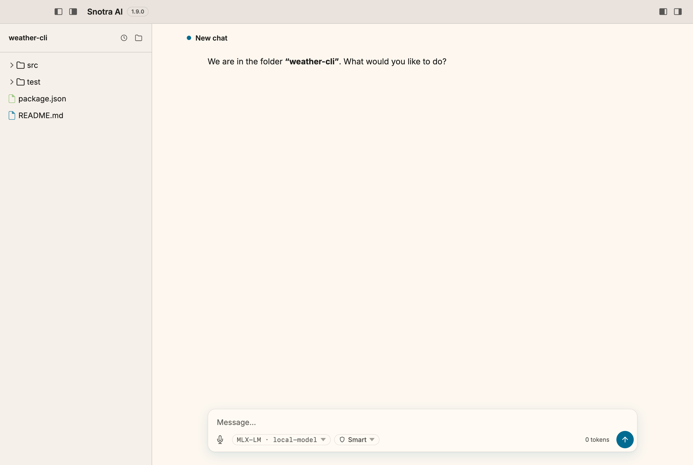
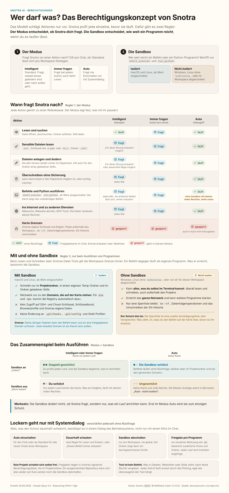

# Snotra Agent

**Ein quelloffener Desktop-Agent, der um deinen Ordner gebaut ist: immer im
Blick, und nichts passiert darin, ohne dass er fragt. Cloud- oder lokale
Modelle, kein Konto, keine Telemetrie.**

[**Download**](https://github.com/kkrafft1999/snotra/releases/latest) ·
[**Handbuch**](https://docs.snotra-ai.dev/de/) ·
[Website](https://snotra-ai.de) ·
[Warum Snotra?](#warum-snotra) ·
[Aus dem Quellcode bauen](#aus-dem-quellcode-bauen) ·
[English](./README.md)

Snotra Agent ist die Desktop-App der Plattform Snotra AI. Bis Oktober 2026 hieß
die App selbst Snotra AI — siehe
[Alte Versionen](https://docs.snotra-ai.dev/de/updating/by-hand/#alte-versionen) im Handbuch.

<picture>
  <source media="(prefers-color-scheme: dark)" srcset="assets/readme/demo-dark.gif">
  
</picture>

**Funktioniert mit** OpenAI · Anthropic · Google Gemini · Ollama · jeder
OpenAI-kompatiblen API (LM Studio, MLX-LM, llama.cpp, vLLM, OpenRouter …)

**Erweiterbar mit** Agent Skills (`SKILL.md`) · MCP-Servern (stdio) ·
eingebauten Workspace-Werkzeugen · jedem CLI auf deinem Rechner

**Läuft auf** macOS (Apple Silicon) · Windows (x64) · Linux (x64)

> Status: ein privates Open-Source-Projekt — keine Firma dahinter, kein
> Bezahlmodell. Schnittstellen und Konfiguration können sich noch ändern.

> **Du willst Snotra benutzen?** Das [Handbuch](https://docs.snotra-ai.dev/de/)
> erklärt Schritt für Schritt mit Screenshots, wie du es installierst, ein
> Modell verbindest, chattest, die Kontrolle darüber behältst, was es darf, und
> es anpasst. Diese Seite ist die Übersicht und der Entwicklerteil.

## Wie Snotra arbeitet

- **Der Ordner ist der Arbeitsplatz.** Du öffnest einen Ordner; der Dateibaum
  bleibt im Blick, und der Chat arbeitet darin. Dateien, die der Agent
  schreibt, erscheinen, während er sie schreibt.
- **Er fragt, bevor er handelt.** Im Standardmodus *Intelligent* liest er, ohne zu
  fragen; eine Datei ändern oder eine sensible anfassen fragt vorher. Befehle
  ausführen ist aus, bis du es einschaltest, und dann bekommt jeder Befehl
  seine eigene Freigabe-Karte.
- **Auto ist deine Entscheidung, nicht der Standard.** Der Modus *Auto* lässt
  die Rückfragen weg — Workspace-Grenzen, Sperren und der Schutz der
  Snotra-Schlüssel bleiben. Du schaltest ihn bewusst ein, für einen Chat oder
  als Standard eines Ordners, dem du vertraust.
- **Deine Modelle, deine Schlüssel.** Cloud- und lokale Modelle stehen in einer
  Liste nebeneinander; du wechselst je Unterhaltung. Schlüssel liegen in der
  Verschlüsselung des Betriebssystems.
- **Nichts meldet sich nach Hause.** Kein Konto, kein eigener Server, keine
  Telemetrie — auch nicht als Opt-in.

## Download

Die neueste Version liegt auf der
[Release-Seite](https://github.com/kkrafft1999/snotra/releases/latest):

| System | Datei |
| --- | --- |
| macOS (Apple Silicon) | `Snotra-Agent-<version>-mac-arm64.dmg` |
| Windows (x64) | `Snotra-Agent-<version>-win-x64.zip` |
| Linux (x64) | `.deb` (empfohlen), `.AppImage` oder `.tar.gz` — siehe [Snotra Agent installieren](https://docs.snotra-ai.dev/de/getting-started/install/#auf-linux-installieren) |

- **macOS:** Die App ist mit einer Developer ID signiert und von Apple
  notarisiert ([#662](https://github.com/kkrafft1999/snotra/issues/662)). DMG
  öffnen, App nach Programme ziehen und starten — macOS fragt nur einmal, ob du
  eine aus dem Internet geladene App öffnen willst.
- **Windows:** Der Build ist noch nicht signiert
  ([#19](https://github.com/kkrafft1999/snotra/issues/19)), deshalb warnt
  SmartScreen beim ersten Start. ZIP entpacken, `Snotra Agent.exe` starten, dann
  *SmartScreen › Weitere Informationen › Trotzdem ausführen*.

## Warum Snotra?

Open Source, beliebige Modelle, MCP und Skills bietet inzwischen jeder
Agent-Desktop. Snotra unterscheidet sich darin, wie es in deinem Ordner
arbeitet und wie vorsichtig es dort handelt. Verglichen im September 2026 —
das Feld bewegt sich schnell, Korrekturen willkommen.

- **Goose** — der nächste Open-Source-Verwandte, und ein gutes Werkzeug. Goose
  arbeitet per Default autonom; Snotra startet mit ausgeschalteter
  Befehlsausführung und fragt vor jedem Befehl. Ein „erlauben“ für die ganze
  Sitzung gibt es für Befehle nicht, außer du schaltest die ganze App auf
  *Auto*. Goose' Nutzungsdaten sind Opt-in; bei Snotra gibt es keine.
- **Claude Desktop / ChatGPT Desktop** — ausgereift, und sie isolieren gut.
  Aber sie brauchen ein Konto und ein Abo, sie hängen an einem Anbieter, und
  lokale Modelle sind Nebensache.
- **LM Studio (Bionic)** — hervorragend, um lokale Modelle zu betreiben, mit
  nativem MLX. Aber der Agent ist nicht quelloffen, und seine Cloud ist die
  von LM Studio, also ohne Modelle von OpenAI, Anthropic oder Google. Snotra
  nutzt LM Studio als einen Provider unter mehreren und behandelt Cloud- und
  lokale Modelle gleich.
- **Jan** — quelloffen und local-first. Sein Ordner-Agent und seine Sandbox
  stecken in Nightly- und Preview-Builds; die stabile App ist ein Chat-Client
  mit MCP.
- **Cherry Studio** — sehr umfangreich und im Umfang nah dran. Analytics sind
  per Default an, und eine Sandbox für Agent-Befehle ist nicht dokumentiert.
- **AnythingLLM** — gebaut, um mit den eigenen Dokumenten zu chatten (RAG).
  Seine Skills sind NodeJS-Code, keine Textdateien, und es hat kein
  Shell-Werkzeug.
- **Open WebUI / LibreChat** — selbst gehostete Web-Apps mit Login und Docker:
  ein Server fürs Team, kein Desktop-Agent in deinem Ordner.
- **Msty** — nicht quelloffen. Sein Agent-Modus verpackt Cloud-Coding-CLIs,
  statt einen eigenen Agenten auf deinen Modellen laufen zu lassen.
- **VS Code + Copilot/Cline, Cursor** — sie haben den Dateibaum, weil sie
  Code-Editoren sind. Snotra hält den Ordner im Blick, ohne eine IDE zu sein,
  für Arbeit, die kein Code ist.

Was Snotra noch fehlt: signierte Builds
([#19](https://github.com/kkrafft1999/snotra/issues/19)), eine Sandbox unter
Windows (unter macOS und Linux laufen Befehle und Python isoliert — siehe [Befehle in der
Sandbox ausführen](https://docs.snotra-ai.dev/de/safety/sandbox/)), MCP über HTTP
([#341](https://github.com/kkrafft1999/snotra/issues/341)).

## Motivation

*Ein Wort des Autors.* Angefangen hat es mit dem Wunsch, **agentisches Arbeiten
zu verstehen** — was zwischen einem Sprachmodell und einem Agent Harness
tatsächlich hin- und hergeht. Das Experiment ist gewachsen, weil es Freude
macht, Snotra eine weitere Fähigkeit mitzugeben. Cursor, Claude Code und ChatGPT
sind die naheliegenden Vorbilder, aber jedes konzentriert sich auf die eigenen
Modelle. Ein Agent Desktop, an den sich **beliebige Modelle** anbinden lassen —
vor allem lokale —, ist der Grund, warum ich drangeblieben bin.

Es soll auch eine Grundlage sein: ein Werkzeug, mit dem Entwickler agentisches
Arbeiten selbst ausprobieren und Agenten für **konkrete Use Cases** bauen
können — für eine Fachabteilung genauso wie für zu Hause —, aufgesetzt auf dem
Agent Harness von Snotra. Die Architektur ist so geschnitten, dass sich das
Backend vom Frontend trennen lässt.

Der Name stammt aus der nordischen Mythologie: Snotra ist die Göttin der
Klugheit und Besonnenheit — ein Assistent, der den Kontext seines Workspace
kennt und überlegt handelt.

## Aktueller Stand & Planung

Was offen ist, steht auf dem
[GitHub-Project-Board](https://github.com/users/kkrafft1999/projects/2) und in
den [GitHub Issues](https://github.com/kkrafft1999/snotra/issues). Was die App
heute kann, beschreibt das [Handbuch](https://docs.snotra-ai.dev/de/).
Du willst mitmachen? Siehe [`CONTRIBUTING.md`](./CONTRIBUTING.md) (Englisch).

## Tech-Stack

- [Electron](https://www.electronjs.org/) (Main + Renderer + Preload)
- [Electron Forge](https://www.electronforge.io/) für Packaging & Maker (DMG / ZIP / DEB / AppImage)
- Vanilla JS im Renderer + [`marked`](https://github.com/markedjs/marked) und [`DOMPurify`](https://github.com/cure53/DOMPurify) für Markdown
- [`@fontsource/inter`](https://fontsource.org/fonts/inter) als Schriftart

## Voraussetzungen

- **Node.js** ≥ 24 (Active LTS, siehe `.nvmrc`; mit nvm: `nvm use`)
- **npm** (kommt mit Node)
- macOS, Windows oder Linux
- Optional: API-Key für OpenAI / Anthropic / Google, ein lokales [Ollama](https://ollama.com/) oder irgendein anderer Server mit OpenAI-kompatibler Schnittstelle (LM Studio, llama.cpp, vLLM, OpenRouter, ein Firmen-Gateway — siehe [Ein Modell anbinden](https://docs.snotra-ai.dev/de/getting-started/connect-a-model/))

## Aus dem Quellcode bauen

```bash
# Repository klonen
git clone git@github.com:<dein-user>/snotra.git
cd snotra

# Abhängigkeiten installieren
npm install

# App im Entwicklungsmodus starten
npm start
```

Beim ersten Start kannst du in den Einstellungen einen Provider wählen und deinen API-Key eintragen. Der Key wird verschlüsselt im Benutzerprofil deines Betriebssystems abgelegt – er landet **nicht** im Projektordner und nicht im Repository.

## App bauen / paketieren

```bash
# macOS (Apple Silicon) – DMG
npm run make

# Linux (x64) – DEB + AppImage; braucht dpkg, fakeroot und mksquashfs
npm run make:linux

# Nur paketieren ohne Installer
npm run package         # macOS arm64
npm run package:win     # Windows x64
npm run package:linux   # Linux x64
```

Die fertigen Artefakte landen im Ordner `out/` (per `.gitignore` ausgeschlossen).

## Tastenkürzel

*Das Handbuch hat noch kein Nachschlage-Kapitel ([#787](https://github.com/kkrafft1999/snotra/issues/787)); bis dahin stehen die Kürzel hier.*

Was Snotra zu den üblichen Systemkürzeln hinzufügt. Kopieren, Einfügen, Rückgängig, Zoom und Vollbild verhalten sich wie in jeder anderen App deiner Plattform und stehen in den Menüs *Bearbeiten*, *Ansicht* und *Fenster*.

**Überall im Fenster**

| Was es tut | macOS | Windows / Linux |
| --- | --- | --- |
| Einstellungen öffnen | `Cmd+,` | `Strg+,` |
| Seitenleiste ein- oder ausblenden | `Cmd+B` | `Strg+B` |
| Versteckte Dateien im Baum zeigen oder verbergen | `Cmd+Shift+.` | `Strg+Shift+.` |
| Den Dateibaum filtern | `Cmd+P` | `Strg+P` |
| Tool-Log-Diagnose als JSON in die Zwischenablage kopieren — nützlich für einen Fehlerbericht | `Cmd+Shift+D` | `Strg+Shift+D` |

**Chat-Eingabe**

| Was es tut | macOS | Windows / Linux |
| --- | --- | --- |
| Nachricht abschicken | `Enter` | `Enter` |
| Zeilenumbruch einfügen | `Shift+Enter` | `Shift+Enter` |
| Bild aus der Zwischenablage als Anhang einfügen | `Cmd+V` | `Strg+V` |
| In der `@`-Dateiliste oder der `/`-Skill-Liste: wählen · übernehmen · schließen | `↑`/`↓` · `Enter` oder `Tab` · `Esc` | `↑`/`↓` · `Enter` oder `Tab` · `Esc` |
| Die sichtbare Freigabekarte eines Tools ablehnen | `Esc` | `Esc` |

**Dateibaum und Spalten**

| Was es tut | macOS | Windows / Linux |
| --- | --- | --- |
| Kontextmenü einer Zeile öffnen (statt Rechtsklick) | `Cmd`-Klick | `Strg`-Klick |
| Den Filter mit einem Buchstaben beginnen | in den fokussierten Baum tippen | in den fokussierten Baum tippen |
| Im Filter: wählen · öffnen · schließen | `↑`/`↓` · `Enter` · `Esc` | `↑`/`↓` · `Enter` · `Esc` |
| Zeile mit Fokus umbenennen · Namen übernehmen · unverändert lassen | `F2` · `Enter` · `Esc` | `F2` · `Enter` · `Esc` |
| Zuletzt verwendete Ordner: öffnen · aus der Liste entfernen | `Enter` oder `Leertaste` · `Entf` oder `Rücktaste` | `Enter` oder `Leertaste` · `Entf` oder `Rücktaste` |
| Fokussierter Spaltentrenner: verschieben · in größeren Schritten · bis zur Endlage | `←`/`→` · `Shift+←`/`→` · `Pos1`/`Ende` | `←`/`→` · `Shift+←`/`→` · `Pos1`/`Ende` |

**Dialoge und Menüs**

| Was es tut | macOS | Windows / Linux |
| --- | --- | --- |
| Einstellungen: zum vorigen oder nächsten Bereich · zum ersten oder letzten | `↑`/`↓` oder `←`/`→` · `Pos1`/`Ende` | `↑`/`↓` oder `←`/`→` · `Pos1`/`Ende` |
| Dialog, Menü oder vergrößertes Bild schließen | `Esc` | `Esc` |

## Umstieg von „Weyouze Anything“

**Bis v1.0.4:** Beim ersten Start kopiert die App Einstellungen, Presets, Ordner-Historie und Chat-Verlauf aus dem alten `userData`-Ordner; der alte Ordner bleibt unverändert als Backup liegen. Unter macOS müssen die API-Keys einmal neu eingegeben werden, weil der Keychain-Eintrag von Electrons `safeStorage` am App-Namen hängt; die Einstellungen zeigen dann „Key neu eingeben“. Ein dadurch nicht mehr entschlüsselbarer Chat-Verlauf wird als `chat-history.json.undecryptable-<Zeitstempel>` gesichert statt überschrieben. Ein Start mit `--user-data-dir` nimmt den angegebenen Ordner, wie er ist, und kopiert nichts hinein.

## Projektstruktur

```
.
├── src/
│   ├── application/     transport-agnostischer Anwendungs-Core (Chat, Ports)
│   │   ├── chat/        Chat-Engine, Verlaufstrim
│   │   └── ports/       LLM-, Tool-, Preferences- und weitere Kern-Ports
│   ├── main/            Electron Main-Prozess
│   │   ├── composition/ Composition Root (Verdrahtung aller Adapter)
│   │   ├── adapters/    Port-Implementierungen (LLM, Tools, Storage, FS, …)
│   │   ├── ports/       Infrastruktur-Port-Schnittstellen
│   │   ├── ipc/         dünne IPC-Handler
│   │   ├── providers/   LLM-Provider-Implementierungen
│   │   ├── services/    Infrastruktur (Storage, FS, Whisper, Updates, Präsentation)
│   │   └── tools/       Workspace-Tool-Registry
│   ├── preload/         sichere Bridge zwischen Main und Renderer (gebundelt)
│   ├── renderer/        UI (HTML, CSS, JS) — reine Präsentationsschicht
│   └── shared/          Contracts, IPC-Kanäle, gemeinsame Presentation-Helfer
├── system-skills/       eingebaute System-Skills (je Verzeichnis eine `SKILL.md`)
├── test/                Tests (node:test), inkl. Architektur-Grenzwächter
├── scripts/             Build-Helfer (Vendor-Sync für den Renderer, Icon-Build)
├── docs/                Architektur (`architecture.md`, SVG-Diagramme), Release, Sicherheitskonzept
├── assets/icon/         SVG-Quellen des App-Icons (macOS- und Windows-Layout)
├── assets/readme/       Demo-GIF und Standbilder fürs README (hell und dunkel)
├── icon.icns/.ico/.png  App-Icons für macOS / Windows / Linux, erzeugt per `node scripts/build-icons.js`
└── package.json
```

Details zur Schichtenarchitektur: [`docs/architecture.md`](./docs/architecture.md).

## Sicherheitshinweise

Welche Aktion in welchem Modus deine Freigabe braucht und was die Sandbox daran ändert:



Die Einzelheiten stehen im [Sicherheitskonzept](docs/security-concept.md) (englisch).

- API-Keys werden **lokal** gespeichert und nicht an Dritte weitergegeben.
- Der Workspace-Zugriff der Datei-Tools ist auf den jeweils geöffneten Projektordner beschränkt. Ausnahmen: die **Lese**-Tools erreichen zusätzlich die Verzeichnisse der eingeschalteten Skills über `skill:<name>/…` (siehe [Skills nutzen](https://docs.snotra-ai.dev/de/customising/skills/), geschrieben wird dort nie) — und die beiden **Ausführungs**-Tools `run_python` und `shell_execute` kennen diese Grenze grundsätzlich nicht: nicht Snotra greift dort auf Dateien zu, sondern der Interpreter bzw. die Shell. Beide sind deshalb im Lieferzustand abgeschaltet und brauchen außerhalb von *Auto* vor jedem Lauf eine Freigabe. Unter macOS und Linux laufen sie in einer Sandbox, die das Schreiben auf den Projektordner begrenzt und das Netzwerk auf die freigegebenen Domains (siehe [Befehle in der Sandbox ausführen](https://docs.snotra-ai.dev/de/safety/sandbox/)); unter Windows nicht.
- Jeder Tool-Aufruf durchläuft im Main-Prozess eine Policy (Risikoklasse × Modus, Sperr-Regeln, harte Grenzen); Dateiänderungen und der Zugriff auf sensible Dateien brauchen im Standardmodus eine Freigabe (siehe [Sehen und ändern, was Snotra darf](https://docs.snotra-ai.dev/de/safety/tools-and-security/)). Ein Tool-Text, eine Datei oder ein Skill kann keine Berechtigung erteilen.
- Trotzdem gilt: lass das Modell nichts in Ordnern arbeiten, in denen sensible Daten liegen, denen du nicht traust.

## Mitwirken

Voraussetzungen zum Bauen, Test-Befehle und die Branch-/PR-Konventionen stehen
in [`CONTRIBUTING.md`](./CONTRIBUTING.md) (Englisch).

## Lizenz

Apache License 2.0 – siehe [`LICENSE`](./LICENSE).

Copyright © 2026 Konrad Krafft.
