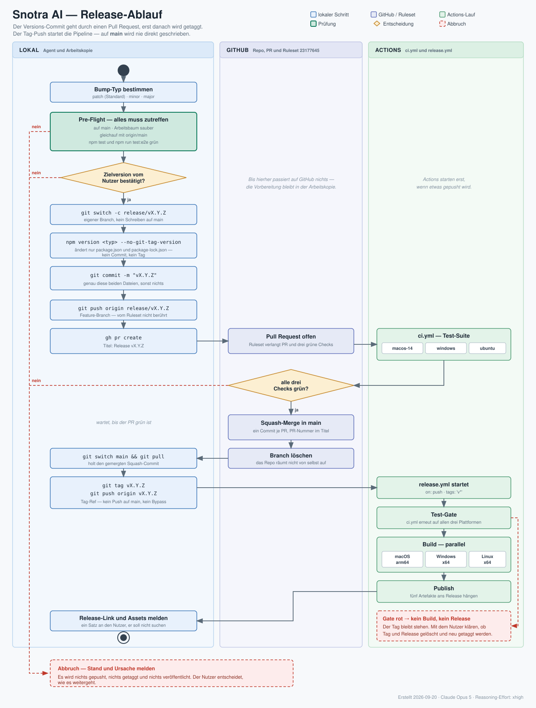

# Release & Self-Update

Die App hat einen **Update-Notifier** (Stufe 1): Beim Start und über
*Hilfe → Nach Updates suchen…* (bzw. den Link in den Einstellungen) prüft sie
das **neueste GitHub-Release** dieses Repos und blendet bei einer neueren
Version ein Banner mit Download-Link ein. Es wird **nichts automatisch
installiert** — der Download läuft über den Browser, Installation manuell.

Damit das funktioniert, muss es überhaupt Releases geben. Dieser Ablauf legt
sie an.

## Voraussetzungen (einmalig)

- Das Repo muss **öffentlich** sein, sonst kann die unsignierte App die
  Releases-API nicht ohne Token lesen:
  ```sh
  gh repo edit kkrafft1999/snotra --visibility public
  ```
- `gh` muss authentifiziert sein (`gh auth status`).

## Ablauf im Überblick



Kurz: Der Versions-Commit geht wie jede andere Änderung durch einen Pull
Request. Erst der gemergte Stand wird getaggt, und allein der Tag-Push startet
die Pipeline. Auf `main` wird nie direkt geschrieben.

## Version als Single Source of Truth

Die angezeigte und verglichene Version kommt aus `version` in
[`package.json`](../package.json) (→ `app.getVersion()`). Genau dieser Wert
entscheidet, ob sich eine laufende Installation als veraltet erkennt — er muss
deshalb zum Release-Tag passen.

Vor jedem Release hochzählen (SemVer), aber **auf einem eigenen Branch**:

```sh
git switch -c release/vX.Y.Z
npm version patch --no-git-tag-version   # oder: minor / major
git commit -am "vX.Y.Z"
git push origin release/vX.Y.Z
gh pr create --title "Release vX.Y.Z"
```

`--no-git-tag-version` ist wesentlich: Ohne die Option committet `npm version`
auf den aktuellen Branch und legt den Tag gleich mit an. Auf `main` ausgeführt
heißt das ein Direkt-Commit, den Ruleset `23177645` nur per Bypass durchlässt
(Issue #238). Mit der Option ändert `npm version` nur `package.json` und
`package-lock.json`.

Nach grünen Pflicht-Checks mergen und den Tag auf den gemergten Stand setzen:

```sh
gh pr merge --squash --delete-branch
git switch main && git pull
git tag vX.Y.Z
```

Der Tag-Ref ist vom Ruleset nicht erfasst (`target: branch`), sein Push also
unkritisch.

## Build

```sh
npm run make            # macOS arm64  -> out/make/*.dmg + ZIP
npm run package:win     # Windows x64  -> out/<productName>-win32-x64/  (zum Zippen)
npm run make:linux      # Linux x64    -> out/make/{deb,AppImage}/x64/* + out/<productName>-linux-x64/
```

Der Linux-Lauf braucht `dpkg`, `fakeroot` (deb) und `mksquashfs`
(AppImage, Paket `squashfs-tools`) — auf macOS fehlt alles davon, dort bricht
Forge mit *„Cannot make for …"* ab; `npm run package:linux` (nur paketieren,
ohne Maker) funktioniert auch von macOS aus.

Der AppImage-Maker lädt zur Build-Zeit den **Type-2-Runtime** von GitHub. Per
Default zieht er ihn vom rollenden `continuous`-Tag; in
[`package.json`](../package.json) ist stattdessen ein **datierter Release
gepinnt**, damit nicht bei jedem Build eine andere Fremdbinärdatei im Artefakt
landet. Ein Test wacht darüber. Zum Anheben die `runtime`-URL bewusst auf einen
neueren Tag setzen — `continuous` ist keine gültige Option.

Die Artefakte landen unter `out/`. Der Vergleich der App nutzt **nur den
Release-Tag**, nicht die Dateinamen — die Asset-Namen sind also frei wählbar,
sollten aber Version und Plattform enthalten, z. B.
`Snotra-AI-1.1.0-mac-arm64.dmg`.

### App-Icon

`icon.icns` (macOS), `icon.ico` (Windows) und `icon.png` (Linux, 512 px) sind
eingecheckt und werden von der Pipeline **nicht** neu gebaut. Quelle sind die
SVGs in `assets/icon/` (`icon-macos.svg` mit Apple-Icon-Raster und Schatten,
`icon-windows.svg` vollflächig — daraus entstehen `.ico` **und** `.png`). Nach
einer Änderung daran einmal lokal erzeugen — braucht `rsvg-convert`
(`brew install librsvg`) und `iconutil` (Xcode Command Line Tools):

```sh
node scripts/build-icons.js
```

## Paketinhalt (Allowlist)

Das `app.asar` enthält **nur Laufzeitdateien**: `src/`, `system-skills/`,
`node_modules/` (Production-Dependencies), `package.json` und `LICENSE`.
Alles andere – `.claude/` (inkl. lokaler `settings.local.json`), `.github/`,
`docs/`, `test/`, `scripts/`, Icon-Quellen, README, Lockfile, `.env*` – bleibt
draußen (Issue #72). Quelle der Wahrheit ist die Negativ-Regex in
[`package.json`](../package.json) → `config.forge.packagerConfig.ignore`;
neue Laufzeitordner müssen dort in die Allowlist aufgenommen werden.

Die Pipeline prüft den Inhalt nach jedem Build-Job automatisch
(`scripts/check-asar-contents.js`, schlägt bei ausgeschlossenen oder fehlenden
Pflichtdateien fehl). Lokal nach `npm run package`:

```sh
npm run check-package
```

## Pipeline und Test-Gate

Zwei GitHub-Actions-Workflows unter [`.github/workflows/`](../.github/workflows/):

- [`ci.yml`](../.github/workflows/ci.yml) führt bei jedem **Pull Request** und
  jedem **Push auf `main`** die Test-Suite (`npm test`, Node 24) auf
  **macOS, Windows und Linux** aus. Ein roter Lauf ist im PR bzw. am Commit
  sichtbar.
- [`release.yml`](../.github/workflows/release.yml) startet auf einen Tag-Push
  `vX.Y.Z`. Als erster Job läuft dieselbe Test-Suite als **Test-Gate**
  (`ci.yml` per `workflow_call`); erst wenn alle drei Plattformen grün sind,
  bauen die Build-Jobs (`build-macos`, `build-windows`, `build-linux`) und
  hängen die Artefakte an das Release. Schlägt ein Test fehl, entsteht **kein**
  Build und **kein** Release — Ursache beheben, Tag neu setzen
  (`git tag -d vX.Y.Z && git push origin :vX.Y.Z`, dann erneut taggen und
  pushen).

Läufe beobachten:

```sh
gh run list --workflow ci.yml --limit 5
gh run watch
```

`main` ist über Ruleset `23177645` geschützt: Änderungen brauchen einen Pull
Request, Force-Push und Löschen sind gesperrt, und die drei Kontexte
`Tests (macos-14)` / `Tests (windows-latest)` / `Tests (ubuntu-latest)` sind
Pflicht. Das Ruleset hat `target: branch` und erfasst deshalb **nur Branches** —
Tags kann man ohne PR pushen, was der Release-Weg oben ausnutzt.

## Release veröffentlichen

Es wird **nur der Tag** gepusht — der Stand liegt über den gemergten PR bereits
auf `main`:

```sh
git push origin vX.Y.Z
```

Das ist der Punkt ohne Wiederkehr: Der Push startet `release.yml`, und am Ende
steht ein öffentliches Release. Quittiert GitHub den Push mit
`Bypassed rule violations for refs/heads/main`, wurde versehentlich doch auf
`main` geschrieben — dann nachsehen, nicht übergehen.

Lauf und Ergebnis:

```sh
gh run list --workflow=release.yml --limit 1
gh run watch <RUN_ID> --exit-status
gh release view vX.Y.Z --json url,assets -q '.url, (.assets[].name)'
```

Release und Assets legt die Pipeline selbst an; die Artefakte heißen
einheitlich `Snotra-AI-<version>-<mac|win|linux>-<arch>.<endung>`. Von Hand
braucht es `gh release create` nur, wenn die Pipeline ausfällt:

```sh
gh release create vX.Y.Z \
  --title "vX.Y.Z" \
  --notes "Was ist neu …" \
  "out/make/Snotra AI.dmg#Snotra AI (macOS, Apple Silicon)"
```

Der Text aus `--notes` erscheint als Release-Body und steht der App im Banner
als `notes` zur Verfügung.

### Vorab-Versionen

Tags mit SemVer-Suffix (`v1.6.0-rc.1`, `v1.5.1-debtest`) veroeffentlicht die
Pipeline als **Prerelease**. Das ist die Absicherung fuer Testlaeufe: Die App
fragt `GET /releases/latest` ab, und GitHub liefert dort weder Drafts noch
Prereleases — ein Testbuild wird laufenden Installationen also nie als Update
angeboten. Ohne Suffix entsteht wie bisher ein regulaeres Release.

> Hinweis: Solange die App **nicht code-signiert** ist, zeigt macOS beim ersten
> Start der neuen Version den Gatekeeper-Dialog. Das ist erwartet und kein
> Fehler des Update-Wegs. Linux braucht keine Signatur; dort ist nur der
> Sandbox-Hinweis zum Tarball relevant (siehe README).

## Was die App prüft

- Endpoint: `GET https://api.github.com/repos/kkrafft1999/snotra/releases/latest`
- Installationen bis v1.0.4 fragen noch `kkrafft1999/weyouze` ab; GitHub leitet
  per 301 auf das umbenannte Repo um. Den alten Repo-Namen deshalb **nie
  wiederverwenden**, sonst bricht der Update-Hinweis alter Versionen.
- Vergleich: `tag_name` (ohne führendes `v`) gegen `app.getVersion()` via SemVer.
- **Drafts** werden ignoriert; **Prereleases** werden als solche markiert.
- Mit *Überspringen* gemerkte Versionen melden sich beim Auto-Check nicht mehr,
  ein manueller Check zeigt sie wieder.

Implementierung: [`src/main/services/update-service.js`](../src/main/services/update-service.js),
Tests: [`test/update-service.test.js`](../test/update-service.test.js).
