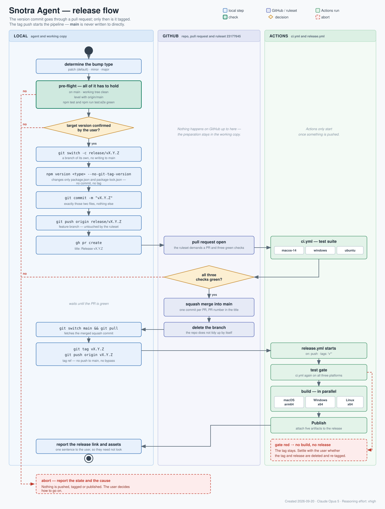

# Release and self-update

The app **updates itself** (#232): at startup, and via
*Help → Check for updates…* (or the link in the settings), it checks the
**latest GitHub release** of this repository. When a newer version exists, a
dialog walks through the update — download, install, restart — and **every step
needs the user's confirmation** and can be cancelled until installation starts.
Nothing is downloaded or installed without that confirmation. Installations
that cannot replace themselves (a `.deb` under `/opt`, a location without write
permission, a development build) get a link to the release page instead. The
user's side of this is described in the README, section *Updating*.

For that to work there have to be releases in the first place. This is the
procedure that creates them.

## Prerequisites (once)

- The repository has to be **public**, otherwise the app cannot read
  the releases API without a token:
  ```sh
  gh repo edit kkrafft1999/snotra --visibility public
  ```
- The **macOS signing secrets** are set in the repository (#662):
  `MACOS_CERT_P12_BASE64`, `MACOS_CERT_PASSWORD`, `APPLE_API_KEY_P8_BASE64`,
  `APPLE_API_KEY_ID`, `APPLE_API_ISSUER` and `APPLE_TEAM_ID`. How they were made
  and when they expire is in
  [`release/macos-signing-plan.md`](release/macos-signing-plan.md).
- `gh` has to be authenticated (`gh auth status`).

## The flow at a glance



In short: the version commit goes through a pull request like every other
change. Only the merged state is tagged, and the tag push alone starts the
pipeline. `main` is never written to directly.

## The version as the single source of truth

The version that is displayed and compared comes from `version` in
[`package.json`](../package.json) (→ `app.getVersion()`). Exactly that value
decides whether a running installation recognises itself as out of date, so it
has to match the release tag.

Bump it before every release (SemVer), but **on a branch of its own**:

```sh
git switch -c release/vX.Y.Z
npm version patch --no-git-tag-version   # or: minor / major
git commit -am "vX.Y.Z"
git push origin release/vX.Y.Z
gh pr create --title "Release vX.Y.Z"
```

`--no-git-tag-version` is essential: without it, `npm version` commits to the
current branch and creates the tag straight away. Run on `main` that means a
direct commit — and ruleset `23177645` rejects it, now that no bypass actor is
left (issues #238 and #240). With the option, `npm version` only changes
`package.json` and `package-lock.json`.

Once the required checks are green, merge and put the tag on the merged state:

```sh
gh pr merge --squash --delete-branch
git switch main && git pull
git tag vX.Y.Z
```

The tag ref is not covered by the ruleset (`target: branch`), so pushing it is
uncritical.

## Build

```sh
npm run make            # macOS arm64  -> out/make/Snotra-AI-<version>-mac-arm64.dmg
npm run package:win     # Windows x64  -> out/<productName>-win32-x64/  (to be zipped)
npm run make:linux      # Linux x64    -> out/make/{deb,AppImage}/x64/* + out/<productName>-linux-x64/
```

The Linux run needs `dpkg`, `fakeroot` (deb) and `mksquashfs` (AppImage,
package `squashfs-tools`) — macOS has none of them, and Forge aborts there with
*"Cannot make for …"*; `npm run package:linux` (packaging only, without the
maker) does work from macOS.

Every AppImage starts with the **type-2 runtime**, a binary from
`AppImage/type2-runtime`. Left alone, the maker would download it at build time
from the rolling `continuous` tag, unchecked. Instead `npm run make:linux` first
runs [`scripts/fetch-appimage-runtime.js`](../scripts/fetch-appimage-runtime.js),
which downloads a **dated release** and writes it to
`out/appimage-runtime/runtime-x86_64` only if its SHA-256 matches the pinned one
(#573). The maker's `runtime` in [`package.json`](../package.json) points at
that file. A test guards both. To raise it, change URL and SHA-256 in the script
together — GitHub lists the digest next to each release asset.

The artifacts end up under `out/`. The app's comparison uses **the release tag
only**, not the file names — so the asset names can be chosen freely, but should
carry the version and the platform, e.g. `Snotra-AI-1.1.0-mac-arm64.dmg`.

### The macOS DMG

Since #685 the DMG is not built by Forge but by
[`scripts/make-dmg.js`](../scripts/make-dmg.js), which `npm run make` runs after
packaging. It uses only system tools (`hdiutil`, `ditto`, `xattr`); the former
chain `maker-dmg` → `electron-installer-dmg` → `appdmg` showed the Electron logo
as the volume icon, failed now and then on `hdiutil detach`, and kept an
unmaintained `image-size` in the lock file.

The image holds the signed `Snotra AI.app`, an `/Applications` symlink, Snotra's
`icon.icns` as the volume icon, the window background
[`assets/macos/dmg-background.tiff`](../assets/macos/dmg-background.tiff) in
`.background/` and the window layout from
[`assets/macos/dmg-layout.DS_Store`](../assets/macos/dmg-layout.DS_Store): icon
view without toolbar, status bar or sidebar, the app on the left, Applications
on the right and a grey arrow between them.

The background is **transparent apart from the arrow**. #685 started without
any picture, because Finder colours the labels after the system appearance and
a coloured picture leaves them unreadable in one of the modes. Trying it out
showed the other side: as soon as a picture is set, Finder draws the whole
window light, in dark mode too, with dark labels. So the window does not follow
dark mode, but it stays readable in both. The hidden files (`.VolumeIcon.icns`,
`.background`) are placed below the visible area, so they stay out of sight
even when Finder shows hidden files.

The script builds a read-write image, mounts it once with `-nobrowse` to set the
custom-icon flag on the volume root (`hdiutil create -srcfolder` does not carry
it over), detaches it and converts it to a compressed `ULFO` image. Signing,
notarising and stapling the DMG stay in `release.yml`.

**Changing the layout.** The `.DS_Store` is generated with Finder and checked
in; CI never scripts Finder. The arrow's source is
[`assets/macos/dmg-background.svg`](../assets/macos/dmg-background.svg), drawn in
Finder points on the icons' line. After changing it, rebuild the TIFF with both
resolutions (needs `rsvg-convert`, see below):

```sh
rsvg-convert -w 540 -h 360 assets/macos/dmg-background.svg -o /tmp/bg.png
rsvg-convert -w 1080 -h 720 assets/macos/dmg-background.svg -o /tmp/bg@2x.png
sips -s dpiWidth 144 -s dpiHeight 144 /tmp/bg@2x.png
tiffutil -cathidpicheck /tmp/bg.png /tmp/bg@2x.png -out assets/macos/dmg-background.tiff
```

Then run `sh scripts/make-dmg-layout.sh`. It builds a small read-write image
with the real volume name, lets Finder set the view and copies the resulting
`.DS_Store` over the asset. Eject every mounted *Snotra AI* first — Finder
confuses volumes of the same name, and the alias to the background picture is
resolved by that name. The script works under `/tmp/snotra-dmg-layout` because
Finder writes the image's path into the alias. Positions, window size and
icon size live in the script, the arrow in the SVG; `test/make-dmg.test.js`
checks that both still agree and that no local path slipped into the file.

### The app icon

`icon.icns` (macOS), `icon.ico` (Windows) and `icon.png` (Linux, 512 px) are
checked in and are **not** rebuilt by the pipeline. Their source are the SVGs in
`assets/icon/` (`icon-macos.svg` with the Apple icon grid and shadow,
`icon-windows.svg` full-bleed — both `.ico` **and** `.png` come from it). After
changing one of them, generate the icons locally once — this needs
`rsvg-convert` (`brew install librsvg`) and `iconutil` (Xcode command line
tools):

```sh
node scripts/build-icons.js
```

## What goes into the package (the allowlist)

The `app.asar` contains **runtime files only**: `src/`, `system-skills/`,
`node_modules/` (production dependencies), `package.json` and `LICENSE`.
Everything else — `.claude/` (including a local `settings.local.json`),
`.github/`, `docs/`, `test/`, `scripts/`, the icon sources, the README, the lock
file, `.env*` — stays out (issue #72). The source of truth is the negative regex
in [`package.json`](../package.json) → `config.forge.packagerConfig.ignore`; new
runtime folders have to be added to the allowlist there.

The pipeline checks the contents automatically after every build job
(`scripts/check-asar-contents.js`, which fails on excluded files or missing
mandatory ones). Locally, after `npm run package`:

```sh
npm run check-package
```

## Pipeline and test gate

Two GitHub Actions workflows under [`.github/workflows/`](../.github/workflows/):

- [`ci.yml`](../.github/workflows/ci.yml) runs the test suite (`npm test`, Node
  24) on **macOS, Windows and Linux** for every **pull request** and every
  **push to `main`**. A red run is visible on the pull request or on the commit.
- [`release.yml`](../.github/workflows/release.yml) starts on a tag push
  `vX.Y.Z`. Its first job checks the **tag**: `X.Y.Z` has to be exactly the
  `version` in `package.json` at the tagged commit, and that commit has to be on
  `main` (#570). A tag that fails either check stops the run before anything is
  built — a release is offered to every running installation, so a tag on the
  wrong commit must not get that far. Prerelease tags (with a `-`) are never
  offered as an update and skip this check. Then the same test suite runs as a
  **test gate** (`ci.yml` via `workflow_call`); only when all three platforms
  are green do the build
  jobs (`build-macos`, `build-windows`, `build-linux`) run and attach their
  artifacts to the release. If a test fails, **no** build and **no** release
  comes into existence — fix the cause, set the tag again
  (`git tag -d vX.Y.Z && git push origin :vX.Y.Z`, then tag and push anew).

Watching runs:

```sh
gh run list --workflow ci.yml --limit 5
gh run watch
```

`main` is protected by ruleset `23177645`: changes need a pull request,
force-push and deletion are blocked, and the three contexts
`Tests (macos-14)` / `Tests (windows-latest)` / `Tests (ubuntu-latest)` are
mandatory. Since 2026-09-20 nobody is left in `bypass_actors` (#240) — the rules
apply to the owner as well. The ruleset has `target: branch` and therefore
covers **branches only** — tags can be pushed without a pull request, which is
what the release path above makes use of.

## Manual checks before tagging

What the tests cannot see is looked at by hand, in the packaged app of the
release branch.

### New file, new folder, rename in the tree

The DOM tests (`test/file-tree-create-rename-dom.test.js`) and the disk tests
(`test/fs-create-rename.test.js`) cover the flow and the boundary. What they
cannot cover is the native menu, the field as drawn and the file systems of the
other platforms (#349). `node e2e/manual-tree-create-rename.mjs [en|de]` drives
most of it on the Mac and photographs it to `out/mockup/`; on Windows and Linux
by hand:

1. Right-click a file: "New File…" and "New Folder…" follow "Open", "Rename…"
   (with `F2` shown) sits above "Delete…". Right-click the empty space below the
   rows: "New" only, no "Rename…" or "Delete…".
2. "New File…" on a closed folder opens it and shows a field where the file
   will land. Type `notes.md`, `Enter`: the file is selected and in the preview.
3. In the field type `a:b`, then the name of a neighbour: each time an amber
   message under the field says why, and `Enter` does nothing. `Esc` removes the
   field, nothing is written.
4. `F2` on `readme.md`, type `README.md`, `Enter`: the tree and the file
   manager both show `README.md` — the case-only rename, on NTFS in particular.
5. Rename the folder that holds the file on show: the preview stays, under the
   new path, and its open subfolders stay open.
6. A folder without write permission: "New File…" there says so under the field.
7. Both header buttons in light and dark, and at the narrowest sidebar the
   buttons move to a line of their own instead of squeezing the folder name.

### Keyboard in the file tree

The DOM tests (`test/file-tree-keyboard-dom.test.js`) cover where the keys
go. What they cannot cover is the focus ring as drawn, the native context menu
and a screen reader (#74). With a folder open that has subfolders:

1. Click into the chat input, then press `Shift+Tab` until the focus is in the
   tree. It lands on **one** row — the selected one, or the first — and that
   row shows a blue ring inside its edges. Pressing `Tab` again leaves the
   tree in one step (to the sidebar divider), not row by row.
2. `↓` / `↑` move the ring over the visible rows, `Home` / `End` jump to the
   first and the last. Rows inside a closed folder are skipped.
3. On a closed folder `→` opens it without selecting it (no blue stripe); a
   second `→` moves into it. `←` on a child goes back to the folder, `←` on the
   open folder closes it.
4. `Enter` on a file shows it in the middle column and selects the row;
   `Enter` on a folder opens or closes it.
5. The focused row shows its `@` button; `Shift+Enter` puts the reference into
   the chat input instead of clicking it. The button's tooltip names the key.
6. `Shift+F10` (and on Windows/Linux the context-menu key) opens the context
   menu **below the row's name** — not at the mouse pointer. `Esc` closes it,
   and the focus is back on the row.
7. With the row focused, have the agent or the terminal delete that file. The
   row disappears and the focus stays in the tree on another row.
8. With VoiceOver (`⌘F5`) on macOS: the tree is announced as "Files", a row as
   its name with level, "collapsed"/"expanded" and "selected"; a row with an
   agent mark reads the mark as its description, a folder that cannot be read
   reads the reason.

### Filtering the file tree

The DOM tests (`test/file-tree-filter-dom.test.js`) cover what the filter
finds, where the keys go and where the focus returns. What they cannot cover
is the menu's key equivalent, the drawn list and a screen reader (#350); the
look script `e2e/manual-tree-filter.mjs` photographs the states. With a folder
open:

1. Click into the chat input and press `Cmd+P` (`Ctrl+P`). The field opens
   above the tree with the focus in it; the tree stays visible until you type.
   With the sidebar hidden (`Cmd+B` first), `Cmd+P` brings it back.
2. Type a few letters of a file deep in a closed folder. The tree gives way to
   a list: name, folder underneath, matched letters underlined, the first
   entry selected, the count at the bottom. Type the same after `@` in the
   chat input — the first eight entries are the same, in the same order.
3. `↓` / `↑` move the selection; `Enter` shows the file in the middle column
   and the list stays. `Esc` brings the tree back, unfolded to that file and
   with it selected; the focus is back in the chat input.
4. Focus a row in the tree and type a letter: the field opens with it. `Esc`
   returns the focus to the row. A folder picked with `Enter` closes the
   filter and is shown open in the tree, with the focus on it.
5. Type something that matches nothing: one sentence names the query. Delete
   the field: the tree is back.
6. With the filter open on a query, create a matching file in Finder or
   Explorer: it appears in the list within a second, the selection stays.
7. Light and dark (*Settings › Appearance*): the selected row shows the blue
   bar on its left like the tree's selection, the underlines stay visible.
8. With VoiceOver: the field is announced as a combo box "Filter files"; the
   arrows read each entry as its name and folder; the count is read when it
   changes.

### HTML pages in the preview

`e2e/html-preview.test.mjs` drives the page through the main process: its
isolation, the blocked requests, links after a click, a reload on change and
an endless loop. What it cannot drive is the real keyboard and mouse on a
native view, which differs per platform (#479); the look script
`e2e/manual-html-preview.mjs` photographs the states. With a folder that holds
an HTML file with a stylesheet next to it and a link to the web:

1. Click the file. The page appears inside the column's frame, styled; the
   notice above it counts what was blocked, **Show** lists it.
2. Drag the divider between chat and preview, hide and show the sidebar and
   the preview column (`Cmd+B` and the title bar buttons), resize the
   window: the page follows the frame without lagging behind or spilling over.
3. Open *Settings*: the page disappears while the dialog is open and comes
   back when it closes. Open the image lightbox from a chat answer: the same.
4. `Tab` from the header tools onto the frame: the blue ring shows around the
   page, and `Tab` now moves through the page's own links. `F6` brings the
   focus back to the app; `Shift+F6` to the tool before the frame.
5. Click the web link: the default browser opens it. Click **Open in
   browser**: the file opens in the default browser.
6. Change the stylesheet in an editor: the page reloads where it was scrolled
   to.
7. Light and dark: the frame and the notice follow the theme, the page is
   shown as authored.

## Publishing the release

**Only the tag** is pushed — the state itself is already on `main` through the
merged pull request:

```sh
git push origin vX.Y.Z
```

This is the point of no return: the push starts `release.yml`, and at the end
there is a public release. If GitHub rejects the push, it was aimed at `main`
instead of at the tag — then look into it, don't work around it.

The run and its result:

```sh
gh run list --workflow=release.yml --limit 1
gh run watch <RUN_ID> --exit-status
gh release view vX.Y.Z --json url,assets -q '.url, (.assets[].name)'
```

The pipeline creates the release and the assets itself; the artifacts are named
uniformly `Snotra-AI-<version>-<mac|win|linux>-<arch>.<extension>`. By hand,
`gh release create` is only needed if the pipeline fails:

```sh
gh release create vX.Y.Z \
  --title "vX.Y.Z" \
  --notes "What's new …" \
  "out/make/Snotra-AI-X.Y.Z-mac-arm64.dmg#Snotra AI (macOS, Apple Silicon)"
```

The text from `--notes` becomes the release body and is shown as "what has
changed" in the update dialog.

### Pre-releases

Tags with a SemVer suffix (`v1.6.0-rc.1`, `v1.5.1-debtest`) are published by the
pipeline as a **prerelease**. That is the safeguard for test runs: the app calls
`GET /releases/latest`, and GitHub serves neither drafts nor prereleases there —
so a test build is never offered as an update to running installations. Without
a suffix, a regular release is created as before.

> Note: the macOS build is signed with a Developer ID, notarised and stapled
> (#662) — the job `Build macOS` fails if Gatekeeper would not accept it. A
> prerelease is signed the same way, so a `-rc` tag is the test run for a change
> to the signing. Windows is still unsigned; SmartScreen warns there on first
> launch. Linux needs no signature; the only relevant point there is the sandbox
> note about the tarball (see the README).

## What the app checks

- Endpoint: `GET https://api.github.com/repos/kkrafft1999/snotra/releases/latest`
- Installations up to v1.0.4 still ask for `kkrafft1999/weyouze`; GitHub
  redirects to the renamed repository with a 301. Never **reuse the old
  repository name**, or the update notice of those old versions breaks.
- Comparison: `tag_name` (without the leading `v`) against `app.getVersion()`
  via SemVer.
- **Drafts** are ignored; **prereleases** are marked as such.
- Versions dismissed with *Skip* stop showing up in the automatic check; a
  manual check shows them again.

Implementation:
[`src/main/services/update-service.js`](../src/main/services/update-service.js),
tests: [`test/update-service.test.js`](../test/update-service.test.js).
